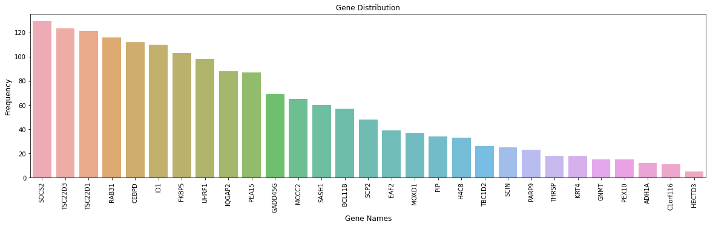

## Functional Enrichment Analysis

### DHT Prioritized Genes


```python
import pandas as pd
import numpy as np
import matplotlib.pyplot as plt
import seaborn as sns
%matplotlib inline
```


```python
#DHT functional enrichment
dht = pd.read_excel(r"F:\snijesh\OneDrive - St John's National Academy of Health Sciences\Re_analysis\SNJ_WorkingDirectory\GSE61368\functional enrichment\dht.xlsx")

#Load toppgene suite mapped ids
toppgene = pd.read_table(r"F:\snijesh\OneDrive - St John's National Academy of Health Sciences\Re_analysis\SNJ_WorkingDirectory\GSE61368\functional enrichment\dht_id_map.txt", sep="\t")

```


```python
dht.columns
```


    Index(['Category', 'ID', 'Name', 'Source', 'p-value', 'q-value Bonferroni',
           'q-value FDR B&H', 'q-value FDR B&Y', 'Hit Count in Query List',
           'Hit Count in Genome', 'Hit in Query List'],
          dtype='object')


```python
dht['Category'].value_counts()
```


    Pubmed                               19370
    Drug                                 12519
    MicroRNA                              9062
    Coexpression                          4587
    Interaction                           4404
    GO: Biological Process                2329
    Disease                               1819
    ToppCell Atlas                        1487
    Coexpression Atlas                     896
    Mouse Phenotype                        822
    Pathway                                484
    Domain                                 353
    GO: Molecular Function                 266
    GO: Cellular Component                 216
    Human Phenotype                         61
    Transcription Factor Binding Site       54
    Computational                           53
    Gene Family                             28
    Name: Category, dtype: int64


```python
dht_sel = dht[['Category', 'ID', 'Name', 'Source', 'p-value','q-value FDR B&H',
           'Hit Count in Query List','Hit Count in Genome', 'Hit in Query List']]
dht_sel.rename(columns = {'q-value FDR B&H':'q-value', 'Hit Count in Query List':'Count', 
                          'Hit Count in Genome': 'Total_Count', 'Hit in Query List':'Genes'}, inplace = True)
```


```python
dht_sel.rename(columns = {'q-value FDR B&H':'q-value', 'Hit Count in Query List':'Count', 
                          'Hit Count in Genome': 'Total_Count', 'Hit in Query List':'Genes'}, inplace = True)
```

    C:\ProgramData\Anaconda3\lib\site-packages\pandas\core\frame.py:4223: SettingWithCopyWarning: 
    A value is trying to be set on a copy of a slice from a DataFrame
    
    See the caveats in the documentation: http://pandas.pydata.org/pandas-docs/stable/user_guide/indexing.html#returning-a-view-versus-a-copy
      return super().rename(**kwargs)
    


```python
dht_sel.columns
```


    Index(['Category', 'ID', 'Name', 'Source', 'p-value', 'q-value', 'Count',
           'Total_Count', 'Genes'],
          dtype='object')


```python
#dht_sel
```


```python
dht_split = dht_sel[dht_sel['q-value'] <= 0.001]
df_syn=dht_split.copy()

dht_splitted = (df_syn.set_index(df_syn.columns.drop('Genes',1).tolist())
 .Genes.str.split(',', expand=True) #use the separator here
 .stack()
 .reset_index()
 .rename(columns={0:'Genes'})
 .loc[:, df_syn.columns])
```


```python
dht_splitted
```


<div>
<style scoped>
    .dataframe tbody tr th:only-of-type {
        vertical-align: middle;
    }

    .dataframe tbody tr th {
        vertical-align: top;
    }

    .dataframe thead th {
        text-align: right;
    }
</style>
<table border="1" class="dataframe">
  <thead>
    <tr style="text-align: right;">
      <th></th>
      <th>Category</th>
      <th>ID</th>
      <th>Name</th>
      <th>Source</th>
      <th>p-value</th>
      <th>q-value</th>
      <th>Count</th>
      <th>Total_Count</th>
      <th>Genes</th>
    </tr>
  </thead>
  <tbody>
    <tr>
      <td>0</td>
      <td>GO: Molecular Function</td>
      <td>GO:0019904</td>
      <td>protein domain specific binding</td>
      <td></td>
      <td>2.286000e-29</td>
      <td>3.218000e-26</td>
      <td>109.0</td>
      <td>833.0</td>
      <td>NOLC1</td>
    </tr>
    <tr>
      <td>1</td>
      <td>GO: Molecular Function</td>
      <td>GO:0019904</td>
      <td>protein domain specific binding</td>
      <td></td>
      <td>2.286000e-29</td>
      <td>3.218000e-26</td>
      <td>109.0</td>
      <td>833.0</td>
      <td>MAPT</td>
    </tr>
    <tr>
      <td>2</td>
      <td>GO: Molecular Function</td>
      <td>GO:0019904</td>
      <td>protein domain specific binding</td>
      <td></td>
      <td>2.286000e-29</td>
      <td>3.218000e-26</td>
      <td>109.0</td>
      <td>833.0</td>
      <td>ACOX1</td>
    </tr>
    <tr>
      <td>3</td>
      <td>GO: Molecular Function</td>
      <td>GO:0019904</td>
      <td>protein domain specific binding</td>
      <td></td>
      <td>2.286000e-29</td>
      <td>3.218000e-26</td>
      <td>109.0</td>
      <td>833.0</td>
      <td>IKZF1</td>
    </tr>
    <tr>
      <td>4</td>
      <td>GO: Molecular Function</td>
      <td>GO:0019904</td>
      <td>protein domain specific binding</td>
      <td></td>
      <td>2.286000e-29</td>
      <td>3.218000e-26</td>
      <td>109.0</td>
      <td>833.0</td>
      <td>ARFIP2</td>
    </tr>
    <tr>
      <td>...</td>
      <td>...</td>
      <td>...</td>
      <td>...</td>
      <td>...</td>
      <td>...</td>
      <td>...</td>
      <td>...</td>
      <td>...</td>
      <td>...</td>
    </tr>
    <tr>
      <td>528371</td>
      <td>Disease</td>
      <td>C1266138</td>
      <td>Benign cystic nephroma</td>
      <td>DisGeNET BeFree</td>
      <td>5.474000e-05</td>
      <td>9.945000e-04</td>
      <td>3.0</td>
      <td>3.0</td>
      <td>PGR</td>
    </tr>
    <tr>
      <td>528372</td>
      <td>Disease</td>
      <td>C1266138</td>
      <td>Benign cystic nephroma</td>
      <td>DisGeNET BeFree</td>
      <td>5.474000e-05</td>
      <td>9.945000e-04</td>
      <td>3.0</td>
      <td>3.0</td>
      <td>DICER1</td>
    </tr>
    <tr>
      <td>528373</td>
      <td>Disease</td>
      <td>C1514915</td>
      <td>Retinal hemangioblastoma</td>
      <td>DisGeNET BeFree</td>
      <td>5.474000e-05</td>
      <td>9.945000e-04</td>
      <td>3.0</td>
      <td>3.0</td>
      <td>CLU</td>
    </tr>
    <tr>
      <td>528374</td>
      <td>Disease</td>
      <td>C1514915</td>
      <td>Retinal hemangioblastoma</td>
      <td>DisGeNET BeFree</td>
      <td>5.474000e-05</td>
      <td>9.945000e-04</td>
      <td>3.0</td>
      <td>3.0</td>
      <td>RBL1</td>
    </tr>
    <tr>
      <td>528375</td>
      <td>Disease</td>
      <td>C1514915</td>
      <td>Retinal hemangioblastoma</td>
      <td>DisGeNET BeFree</td>
      <td>5.474000e-05</td>
      <td>9.945000e-04</td>
      <td>3.0</td>
      <td>3.0</td>
      <td>EPAS1</td>
    </tr>
  </tbody>
</table>
<p>528376 rows × 9 columns</p>
</div>


```python
#Map the data based on genes to get EntrezID
dht_splitted_map = pd.merge(dht_splitted,toppgene, on='Genes', how ='left')
dht_splitted_map
```


<div>
<style scoped>
    .dataframe tbody tr th:only-of-type {
        vertical-align: middle;
    }

    .dataframe tbody tr th {
        vertical-align: top;
    }

    .dataframe thead th {
        text-align: right;
    }
</style>
<table border="1" class="dataframe">
  <thead>
    <tr style="text-align: right;">
      <th></th>
      <th>Category</th>
      <th>ID</th>
      <th>Name</th>
      <th>Source</th>
      <th>p-value</th>
      <th>q-value</th>
      <th>Count</th>
      <th>Total_Count</th>
      <th>Genes</th>
      <th>EntrezID</th>
    </tr>
  </thead>
  <tbody>
    <tr>
      <td>0</td>
      <td>GO: Molecular Function</td>
      <td>GO:0019904</td>
      <td>protein domain specific binding</td>
      <td></td>
      <td>2.286000e-29</td>
      <td>3.218000e-26</td>
      <td>109.0</td>
      <td>833.0</td>
      <td>NOLC1</td>
      <td>9221</td>
    </tr>
    <tr>
      <td>1</td>
      <td>GO: Molecular Function</td>
      <td>GO:0019904</td>
      <td>protein domain specific binding</td>
      <td></td>
      <td>2.286000e-29</td>
      <td>3.218000e-26</td>
      <td>109.0</td>
      <td>833.0</td>
      <td>MAPT</td>
      <td>4137</td>
    </tr>
    <tr>
      <td>2</td>
      <td>GO: Molecular Function</td>
      <td>GO:0019904</td>
      <td>protein domain specific binding</td>
      <td></td>
      <td>2.286000e-29</td>
      <td>3.218000e-26</td>
      <td>109.0</td>
      <td>833.0</td>
      <td>ACOX1</td>
      <td>51</td>
    </tr>
    <tr>
      <td>3</td>
      <td>GO: Molecular Function</td>
      <td>GO:0019904</td>
      <td>protein domain specific binding</td>
      <td></td>
      <td>2.286000e-29</td>
      <td>3.218000e-26</td>
      <td>109.0</td>
      <td>833.0</td>
      <td>IKZF1</td>
      <td>10320</td>
    </tr>
    <tr>
      <td>4</td>
      <td>GO: Molecular Function</td>
      <td>GO:0019904</td>
      <td>protein domain specific binding</td>
      <td></td>
      <td>2.286000e-29</td>
      <td>3.218000e-26</td>
      <td>109.0</td>
      <td>833.0</td>
      <td>ARFIP2</td>
      <td>23647</td>
    </tr>
    <tr>
      <td>...</td>
      <td>...</td>
      <td>...</td>
      <td>...</td>
      <td>...</td>
      <td>...</td>
      <td>...</td>
      <td>...</td>
      <td>...</td>
      <td>...</td>
      <td>...</td>
    </tr>
    <tr>
      <td>528371</td>
      <td>Disease</td>
      <td>C1266138</td>
      <td>Benign cystic nephroma</td>
      <td>DisGeNET BeFree</td>
      <td>5.474000e-05</td>
      <td>9.945000e-04</td>
      <td>3.0</td>
      <td>3.0</td>
      <td>PGR</td>
      <td>5241</td>
    </tr>
    <tr>
      <td>528372</td>
      <td>Disease</td>
      <td>C1266138</td>
      <td>Benign cystic nephroma</td>
      <td>DisGeNET BeFree</td>
      <td>5.474000e-05</td>
      <td>9.945000e-04</td>
      <td>3.0</td>
      <td>3.0</td>
      <td>DICER1</td>
      <td>23405</td>
    </tr>
    <tr>
      <td>528373</td>
      <td>Disease</td>
      <td>C1514915</td>
      <td>Retinal hemangioblastoma</td>
      <td>DisGeNET BeFree</td>
      <td>5.474000e-05</td>
      <td>9.945000e-04</td>
      <td>3.0</td>
      <td>3.0</td>
      <td>CLU</td>
      <td>1191</td>
    </tr>
    <tr>
      <td>528374</td>
      <td>Disease</td>
      <td>C1514915</td>
      <td>Retinal hemangioblastoma</td>
      <td>DisGeNET BeFree</td>
      <td>5.474000e-05</td>
      <td>9.945000e-04</td>
      <td>3.0</td>
      <td>3.0</td>
      <td>RBL1</td>
      <td>5933</td>
    </tr>
    <tr>
      <td>528375</td>
      <td>Disease</td>
      <td>C1514915</td>
      <td>Retinal hemangioblastoma</td>
      <td>DisGeNET BeFree</td>
      <td>5.474000e-05</td>
      <td>9.945000e-04</td>
      <td>3.0</td>
      <td>3.0</td>
      <td>EPAS1</td>
      <td>2034</td>
    </tr>
  </tbody>
</table>
<p>528376 rows × 10 columns</p>
</div>


```python
dht_splitted_map.to_csv(r"F:\snijesh\OneDrive - St John's National Academy of Health Sciences\Re_analysis\SNJ_WorkingDirectory\GSE61368\functional enrichment\dht_split_map.txt", sep="\t", index=False)
```

### Molecular Function


```python
MF = dht_splitted_map[(dht_splitted_map.Category == 'GO: Molecular Function')]
MF.head(4)
```


<div>
<style scoped>
    .dataframe tbody tr th:only-of-type {
        vertical-align: middle;
    }

    .dataframe tbody tr th {
        vertical-align: top;
    }

    .dataframe thead th {
        text-align: right;
    }
</style>
<table border="1" class="dataframe">
  <thead>
    <tr style="text-align: right;">
      <th></th>
      <th>Category</th>
      <th>ID</th>
      <th>Name</th>
      <th>Source</th>
      <th>p-value</th>
      <th>q-value</th>
      <th>Count</th>
      <th>Total_Count</th>
      <th>Genes</th>
      <th>EntrezID</th>
    </tr>
  </thead>
  <tbody>
    <tr>
      <td>0</td>
      <td>GO: Molecular Function</td>
      <td>GO:0019904</td>
      <td>protein domain specific binding</td>
      <td></td>
      <td>2.286000e-29</td>
      <td>3.218000e-26</td>
      <td>109.0</td>
      <td>833.0</td>
      <td>NOLC1</td>
      <td>9221</td>
    </tr>
    <tr>
      <td>1</td>
      <td>GO: Molecular Function</td>
      <td>GO:0019904</td>
      <td>protein domain specific binding</td>
      <td></td>
      <td>2.286000e-29</td>
      <td>3.218000e-26</td>
      <td>109.0</td>
      <td>833.0</td>
      <td>MAPT</td>
      <td>4137</td>
    </tr>
    <tr>
      <td>2</td>
      <td>GO: Molecular Function</td>
      <td>GO:0019904</td>
      <td>protein domain specific binding</td>
      <td></td>
      <td>2.286000e-29</td>
      <td>3.218000e-26</td>
      <td>109.0</td>
      <td>833.0</td>
      <td>ACOX1</td>
      <td>51</td>
    </tr>
    <tr>
      <td>3</td>
      <td>GO: Molecular Function</td>
      <td>GO:0019904</td>
      <td>protein domain specific binding</td>
      <td></td>
      <td>2.286000e-29</td>
      <td>3.218000e-26</td>
      <td>109.0</td>
      <td>833.0</td>
      <td>IKZF1</td>
      <td>10320</td>
    </tr>
  </tbody>
</table>
</div>


```python

```


```python

```


```python
#Remove rows containing values
df.drop(df.loc[df['line_race']==0].index, inplace=True)
df[(df.line_race != 0) & (df.line_race != 10)]

#If you want to delete rows based on multiple values of the column, you could use:
df = df[~df['your column'].isin(['list of strings'])]
```

## E2 Prioritized


```python
#ER functional enrichment
er = pd.read_excel(r"F:\snijesh\OneDrive - St John's National Academy of Health Sciences\Re_analysis\SNJ_WorkingDirectory\GSE61368\functional enrichment\e2.xlsx")
```


```python
#Load toppgene suite mapped ids
er_toppgene = pd.read_table(r"F:\snijesh\OneDrive - St John's National Academy of Health Sciences\Re_analysis\SNJ_WorkingDirectory\GSE61368\functional enrichment\er_id_map.txt", sep="\t")
er_toppgene
```


<div>
<style scoped>
    .dataframe tbody tr th:only-of-type {
        vertical-align: middle;
    }

    .dataframe tbody tr th {
        vertical-align: top;
    }

    .dataframe thead th {
        text-align: right;
    }
</style>
<table border="1" class="dataframe">
  <thead>
    <tr style="text-align: right;">
      <th></th>
      <th>Gene</th>
      <th>EntrezID</th>
    </tr>
  </thead>
  <tbody>
    <tr>
      <td>0</td>
      <td>SERPINB2</td>
      <td>5055</td>
    </tr>
    <tr>
      <td>1</td>
      <td>ATP6V0A4</td>
      <td>50617</td>
    </tr>
    <tr>
      <td>2</td>
      <td>PBX1</td>
      <td>5087</td>
    </tr>
    <tr>
      <td>3</td>
      <td>MRPL11</td>
      <td>65003</td>
    </tr>
    <tr>
      <td>4</td>
      <td>SPTLC2</td>
      <td>9517</td>
    </tr>
    <tr>
      <td>...</td>
      <td>...</td>
      <td>...</td>
    </tr>
    <tr>
      <td>614</td>
      <td>CCN5</td>
      <td>8839</td>
    </tr>
    <tr>
      <td>615</td>
      <td>TSKU</td>
      <td>25987</td>
    </tr>
    <tr>
      <td>616</td>
      <td>SUSD3</td>
      <td>203328</td>
    </tr>
    <tr>
      <td>617</td>
      <td>ACOX2</td>
      <td>8309</td>
    </tr>
    <tr>
      <td>618</td>
      <td>GREB1</td>
      <td>9687</td>
    </tr>
  </tbody>
</table>
<p>619 rows × 2 columns</p>
</div>


```python
er_sel = er[['Category', 'ID', 'Name', 'Source', 'p-value','q-value FDR B&H',
           'Hit Count in Query List','Hit Count in Genome', 'Hit in Query List']]
er_sel.rename(columns = {'q-value FDR B&H':'q-value', 'Hit Count in Query List':'Count', 
                          'Hit Count in Genome': 'Total_Count', 'Hit in Query List':'Gene'}, inplace = True)
er_sel
```


<div>
<style scoped>
    .dataframe tbody tr th:only-of-type {
        vertical-align: middle;
    }

    .dataframe tbody tr th {
        vertical-align: top;
    }

    .dataframe thead th {
        text-align: right;
    }
</style>
<table border="1" class="dataframe">
  <thead>
    <tr style="text-align: right;">
      <th></th>
      <th>Category</th>
      <th>ID</th>
      <th>Name</th>
      <th>Source</th>
      <th>p-value</th>
      <th>q-value</th>
      <th>Count</th>
      <th>Total_Count</th>
      <th>Gene</th>
    </tr>
  </thead>
  <tbody>
    <tr>
      <td>0</td>
      <td>GO: Molecular Function</td>
      <td>GO:0008134</td>
      <td>transcription factor binding</td>
      <td></td>
      <td>2.443000e-13</td>
      <td>3.085000e-10</td>
      <td>65.0</td>
      <td>750.0</td>
      <td>NRIP1,RERG,ESR1,ZMYND8,EYA2,ARID1A,MEIS2,BPTF,...</td>
    </tr>
    <tr>
      <td>1</td>
      <td>GO: Molecular Function</td>
      <td>GO:0016301</td>
      <td>kinase activity</td>
      <td></td>
      <td>8.652000e-12</td>
      <td>4.842000e-09</td>
      <td>103.0</td>
      <td>1621.0</td>
      <td>CDK8,ERBB2,EREG,ABL1,TRIO,MAPT,MAPKAPK2,HIPK1,...</td>
    </tr>
    <tr>
      <td>2</td>
      <td>GO: Molecular Function</td>
      <td>GO:0016772</td>
      <td>transferase activity, transferring phosphorus-...</td>
      <td></td>
      <td>1.150000e-11</td>
      <td>4.842000e-09</td>
      <td>113.0</td>
      <td>1859.0</td>
      <td>CDK8,ERBB2,EREG,ABL1,AICDA,TRIO,MAPT,MAPKAPK2,...</td>
    </tr>
    <tr>
      <td>3</td>
      <td>GO: Molecular Function</td>
      <td>GO:0042802</td>
      <td>identical protein binding</td>
      <td></td>
      <td>2.261000e-11</td>
      <td>7.139000e-09</td>
      <td>118.0</td>
      <td>1997.0</td>
      <td>TPP2,ERBB2,AICDA,MAPT,ESR1,LRRK2,CHKA,TTN,ACOX...</td>
    </tr>
    <tr>
      <td>4</td>
      <td>GO: Molecular Function</td>
      <td>GO:0003712</td>
      <td>transcription coregulator activity</td>
      <td></td>
      <td>1.803000e-10</td>
      <td>4.100000e-08</td>
      <td>51.0</td>
      <td>597.0</td>
      <td>NRIP1,ABL1,HIPK1,ZMYND8,ARID1A,EZH2,TRIP11,MEI...</td>
    </tr>
    <tr>
      <td>...</td>
      <td>...</td>
      <td>...</td>
      <td>...</td>
      <td>...</td>
      <td>...</td>
      <td>...</td>
      <td>...</td>
      <td>...</td>
      <td>...</td>
    </tr>
    <tr>
      <td>95052</td>
      <td>Disease</td>
      <td>C0268436</td>
      <td>Pseudohypoaldosteronism, Type I</td>
      <td>DisGeNET BeFree</td>
      <td>6.788000e-03</td>
      <td>4.962000e-02</td>
      <td>3.0</td>
      <td>13.0</td>
      <td>SCNN1B,SCNN1G,NR3C2</td>
    </tr>
    <tr>
      <td>95053</td>
      <td>Disease</td>
      <td>C4520841</td>
      <td>Pure Erythroid Leukemia</td>
      <td>DisGeNET BeFree</td>
      <td>6.788000e-03</td>
      <td>4.962000e-02</td>
      <td>3.0</td>
      <td>13.0</td>
      <td>ABL1,PDLIM7,MYC</td>
    </tr>
    <tr>
      <td>95054</td>
      <td>Disease</td>
      <td>C0281902</td>
      <td>maladjustment</td>
      <td>DisGeNET BeFree</td>
      <td>6.788000e-03</td>
      <td>4.962000e-02</td>
      <td>3.0</td>
      <td>13.0</td>
      <td>PDLIM7,ARHGAP32,CCND1</td>
    </tr>
    <tr>
      <td>95055</td>
      <td>Disease</td>
      <td>C4688316</td>
      <td>Refractory Breast Carcinoma</td>
      <td>DisGeNET BeFree</td>
      <td>6.788000e-03</td>
      <td>4.962000e-02</td>
      <td>3.0</td>
      <td>13.0</td>
      <td>ERBB2,ESR1,UGCG</td>
    </tr>
    <tr>
      <td>95056</td>
      <td>Disease</td>
      <td>C0341703</td>
      <td>Adult Fanconi syndrome</td>
      <td>DisGeNET BeFree</td>
      <td>6.788000e-03</td>
      <td>4.962000e-02</td>
      <td>3.0</td>
      <td>13.0</td>
      <td>CTSD,OCRL,LRP2</td>
    </tr>
  </tbody>
</table>
<p>95057 rows × 9 columns</p>
</div>


```python
er_split = er_sel[er_sel['q-value'] <= 0.001]
df_syn = er_split.copy()

er_splitted = (df_syn.set_index(df_syn.columns.drop('Gene',1).tolist())
 .Gene.str.split(',', expand=True) #use the separator here
 .stack()
 .reset_index()
 .rename(columns={0:'Gene'})
 .loc[:, df_syn.columns])
```


```python
er_splitted
```


<div>
<style scoped>
    .dataframe tbody tr th:only-of-type {
        vertical-align: middle;
    }

    .dataframe tbody tr th {
        vertical-align: top;
    }

    .dataframe thead th {
        text-align: right;
    }
</style>
<table border="1" class="dataframe">
  <thead>
    <tr style="text-align: right;">
      <th></th>
      <th>Category</th>
      <th>ID</th>
      <th>Name</th>
      <th>Source</th>
      <th>p-value</th>
      <th>q-value</th>
      <th>Count</th>
      <th>Total_Count</th>
      <th>Gene</th>
    </tr>
  </thead>
  <tbody>
    <tr>
      <td>0</td>
      <td>GO: Molecular Function</td>
      <td>GO:0008134</td>
      <td>transcription factor binding</td>
      <td></td>
      <td>2.443000e-13</td>
      <td>3.085000e-10</td>
      <td>65.0</td>
      <td>750.0</td>
      <td>NRIP1</td>
    </tr>
    <tr>
      <td>1</td>
      <td>GO: Molecular Function</td>
      <td>GO:0008134</td>
      <td>transcription factor binding</td>
      <td></td>
      <td>2.443000e-13</td>
      <td>3.085000e-10</td>
      <td>65.0</td>
      <td>750.0</td>
      <td>RERG</td>
    </tr>
    <tr>
      <td>2</td>
      <td>GO: Molecular Function</td>
      <td>GO:0008134</td>
      <td>transcription factor binding</td>
      <td></td>
      <td>2.443000e-13</td>
      <td>3.085000e-10</td>
      <td>65.0</td>
      <td>750.0</td>
      <td>ESR1</td>
    </tr>
    <tr>
      <td>3</td>
      <td>GO: Molecular Function</td>
      <td>GO:0008134</td>
      <td>transcription factor binding</td>
      <td></td>
      <td>2.443000e-13</td>
      <td>3.085000e-10</td>
      <td>65.0</td>
      <td>750.0</td>
      <td>ZMYND8</td>
    </tr>
    <tr>
      <td>4</td>
      <td>GO: Molecular Function</td>
      <td>GO:0008134</td>
      <td>transcription factor binding</td>
      <td></td>
      <td>2.443000e-13</td>
      <td>3.085000e-10</td>
      <td>65.0</td>
      <td>750.0</td>
      <td>EYA2</td>
    </tr>
    <tr>
      <td>...</td>
      <td>...</td>
      <td>...</td>
      <td>...</td>
      <td>...</td>
      <td>...</td>
      <td>...</td>
      <td>...</td>
      <td>...</td>
      <td>...</td>
    </tr>
    <tr>
      <td>357511</td>
      <td>Disease</td>
      <td>C0149925</td>
      <td>Small cell carcinoma of lung</td>
      <td>DisGeNET Curated</td>
      <td>3.919000e-05</td>
      <td>9.825000e-04</td>
      <td>9.0</td>
      <td>54.0</td>
      <td>ID2</td>
    </tr>
    <tr>
      <td>357512</td>
      <td>Disease</td>
      <td>C0149925</td>
      <td>Small cell carcinoma of lung</td>
      <td>DisGeNET Curated</td>
      <td>3.919000e-05</td>
      <td>9.825000e-04</td>
      <td>9.0</td>
      <td>54.0</td>
      <td>SOX2</td>
    </tr>
    <tr>
      <td>357513</td>
      <td>Disease</td>
      <td>C0149925</td>
      <td>Small cell carcinoma of lung</td>
      <td>DisGeNET Curated</td>
      <td>3.919000e-05</td>
      <td>9.825000e-04</td>
      <td>9.0</td>
      <td>54.0</td>
      <td>PAK6</td>
    </tr>
    <tr>
      <td>357514</td>
      <td>Disease</td>
      <td>C0149925</td>
      <td>Small cell carcinoma of lung</td>
      <td>DisGeNET Curated</td>
      <td>3.919000e-05</td>
      <td>9.825000e-04</td>
      <td>9.0</td>
      <td>54.0</td>
      <td>PTEN</td>
    </tr>
    <tr>
      <td>357515</td>
      <td>Disease</td>
      <td>C0149925</td>
      <td>Small cell carcinoma of lung</td>
      <td>DisGeNET Curated</td>
      <td>3.919000e-05</td>
      <td>9.825000e-04</td>
      <td>9.0</td>
      <td>54.0</td>
      <td>TP73</td>
    </tr>
  </tbody>
</table>
<p>357516 rows × 9 columns</p>
</div>


```python
#Map the data based on genes to get EntrezID
er_splitted_map = pd.merge(er_splitted,er_toppgene, on='Gene', how ='left')
er_splitted_map
```


<div>
<style scoped>
    .dataframe tbody tr th:only-of-type {
        vertical-align: middle;
    }

    .dataframe tbody tr th {
        vertical-align: top;
    }

    .dataframe thead th {
        text-align: right;
    }
</style>
<table border="1" class="dataframe">
  <thead>
    <tr style="text-align: right;">
      <th></th>
      <th>Category</th>
      <th>ID</th>
      <th>Name</th>
      <th>Source</th>
      <th>p-value</th>
      <th>q-value</th>
      <th>Count</th>
      <th>Total_Count</th>
      <th>Gene</th>
      <th>EntrezID</th>
    </tr>
  </thead>
  <tbody>
    <tr>
      <td>0</td>
      <td>GO: Molecular Function</td>
      <td>GO:0008134</td>
      <td>transcription factor binding</td>
      <td></td>
      <td>2.443000e-13</td>
      <td>3.085000e-10</td>
      <td>65.0</td>
      <td>750.0</td>
      <td>NRIP1</td>
      <td>8204</td>
    </tr>
    <tr>
      <td>1</td>
      <td>GO: Molecular Function</td>
      <td>GO:0008134</td>
      <td>transcription factor binding</td>
      <td></td>
      <td>2.443000e-13</td>
      <td>3.085000e-10</td>
      <td>65.0</td>
      <td>750.0</td>
      <td>RERG</td>
      <td>85004</td>
    </tr>
    <tr>
      <td>2</td>
      <td>GO: Molecular Function</td>
      <td>GO:0008134</td>
      <td>transcription factor binding</td>
      <td></td>
      <td>2.443000e-13</td>
      <td>3.085000e-10</td>
      <td>65.0</td>
      <td>750.0</td>
      <td>ESR1</td>
      <td>2099</td>
    </tr>
    <tr>
      <td>3</td>
      <td>GO: Molecular Function</td>
      <td>GO:0008134</td>
      <td>transcription factor binding</td>
      <td></td>
      <td>2.443000e-13</td>
      <td>3.085000e-10</td>
      <td>65.0</td>
      <td>750.0</td>
      <td>ZMYND8</td>
      <td>23613</td>
    </tr>
    <tr>
      <td>4</td>
      <td>GO: Molecular Function</td>
      <td>GO:0008134</td>
      <td>transcription factor binding</td>
      <td></td>
      <td>2.443000e-13</td>
      <td>3.085000e-10</td>
      <td>65.0</td>
      <td>750.0</td>
      <td>EYA2</td>
      <td>2139</td>
    </tr>
    <tr>
      <td>...</td>
      <td>...</td>
      <td>...</td>
      <td>...</td>
      <td>...</td>
      <td>...</td>
      <td>...</td>
      <td>...</td>
      <td>...</td>
      <td>...</td>
      <td>...</td>
    </tr>
    <tr>
      <td>357511</td>
      <td>Disease</td>
      <td>C0149925</td>
      <td>Small cell carcinoma of lung</td>
      <td>DisGeNET Curated</td>
      <td>3.919000e-05</td>
      <td>9.825000e-04</td>
      <td>9.0</td>
      <td>54.0</td>
      <td>ID2</td>
      <td>3398</td>
    </tr>
    <tr>
      <td>357512</td>
      <td>Disease</td>
      <td>C0149925</td>
      <td>Small cell carcinoma of lung</td>
      <td>DisGeNET Curated</td>
      <td>3.919000e-05</td>
      <td>9.825000e-04</td>
      <td>9.0</td>
      <td>54.0</td>
      <td>SOX2</td>
      <td>6657</td>
    </tr>
    <tr>
      <td>357513</td>
      <td>Disease</td>
      <td>C0149925</td>
      <td>Small cell carcinoma of lung</td>
      <td>DisGeNET Curated</td>
      <td>3.919000e-05</td>
      <td>9.825000e-04</td>
      <td>9.0</td>
      <td>54.0</td>
      <td>PAK6</td>
      <td>56924</td>
    </tr>
    <tr>
      <td>357514</td>
      <td>Disease</td>
      <td>C0149925</td>
      <td>Small cell carcinoma of lung</td>
      <td>DisGeNET Curated</td>
      <td>3.919000e-05</td>
      <td>9.825000e-04</td>
      <td>9.0</td>
      <td>54.0</td>
      <td>PTEN</td>
      <td>5728</td>
    </tr>
    <tr>
      <td>357515</td>
      <td>Disease</td>
      <td>C0149925</td>
      <td>Small cell carcinoma of lung</td>
      <td>DisGeNET Curated</td>
      <td>3.919000e-05</td>
      <td>9.825000e-04</td>
      <td>9.0</td>
      <td>54.0</td>
      <td>TP73</td>
      <td>7161</td>
    </tr>
  </tbody>
</table>
<p>357516 rows × 10 columns</p>
</div>


```python
er_splitted_map.to_csv(r"F:\snijesh\OneDrive - St John's National Academy of Health Sciences\Re_analysis\SNJ_WorkingDirectory\GSE61368\functional enrichment\er_split_map.txt", sep="\t", index=False)

```

### E2 + DHT


```python
#ER functional enrichment
er = pd.read_excel(r"F:\snijesh\OneDrive - St John's National Academy of Health Sciences\Re_analysis\SNJ_WorkingDirectory\GSE61368\functional enrichment\e2+dht.xlsx")
```


```python

```


```python

```


```python

```

### Interpretation


```python
### Enrichment of DHT Drivers
dht_std = pd.read_excel(r"F:\snijesh\OneDrive - St John's National Academy of Health Sciences\Re_analysis\SNJ_WorkingDirectory\GSE61368\functional enrichment\dht_split_map.xlsx")
dht_std.columns
```


    Index(['Category', 'ID', 'Name', 'Source', 'p-value', 'q-value', 'Count',
           'Total_Count', 'Genes', 'EntrezID', 'CLASS', 'Name.1', 'DHT_FC'],
          dtype='object')


```python
dht_std['Category'].value_counts()
```


    MicroRNA                             228598
    Drug                                  80176
    Interaction                           44335
    GO: Biological Process                42758
    Coexpression                          37866
    Disease                               24892
    Pubmed                                21911
    Coexpression Atlas                    16023
    Mouse Phenotype                       15233
    GO: Molecular Function                 5320
    ToppCell Atlas                         5062
    GO: Cellular Component                 4089
    Pathway                                1429
    Domain                                  417
    Computational                           196
    Gene Family                              42
    Transcription Factor Binding Site        29
    Name: Category, dtype: int64


```python
dht_d = dht_std[dht_std['CLASS']!=0]
dht_d = dht_d[dht_d['CLASS']!='BASE']
dht_d.rename(columns = {'Name.1':'Gene'}, inplace = True)
dht_d
```


<div>
<style scoped>
    .dataframe tbody tr th:only-of-type {
        vertical-align: middle;
    }

    .dataframe tbody tr th {
        vertical-align: top;
    }

    .dataframe thead th {
        text-align: right;
    }
</style>
<table border="1" class="dataframe">
  <thead>
    <tr style="text-align: right;">
      <th></th>
      <th>Category</th>
      <th>ID</th>
      <th>Name</th>
      <th>Source</th>
      <th>p-value</th>
      <th>q-value</th>
      <th>Count</th>
      <th>Total_Count</th>
      <th>Genes</th>
      <th>EntrezID</th>
      <th>CLASS</th>
      <th>Name.1</th>
      <th>DHT_FC</th>
    </tr>
  </thead>
  <tbody>
    <tr>
      <td>12</td>
      <td>GO: Molecular Function</td>
      <td>GO:0019904</td>
      <td>protein domain specific binding</td>
      <td></td>
      <td>2.286000e-29</td>
      <td>3.218000e-26</td>
      <td>109</td>
      <td>833</td>
      <td>H4C8</td>
      <td>8365</td>
      <td>DHT_DRIVEN_UP</td>
      <td>H4C8</td>
      <td>1.514545</td>
    </tr>
    <tr>
      <td>185</td>
      <td>GO: Molecular Function</td>
      <td>GO:0016301</td>
      <td>kinase activity</td>
      <td></td>
      <td>1.073000e-21</td>
      <td>7.557000e-19</td>
      <td>145</td>
      <td>1621</td>
      <td>PEA15</td>
      <td>8682</td>
      <td>DHT_DRIVEN_UP</td>
      <td>PEA15</td>
      <td>1.558514</td>
    </tr>
    <tr>
      <td>208</td>
      <td>GO: Molecular Function</td>
      <td>GO:0016301</td>
      <td>kinase activity</td>
      <td></td>
      <td>1.073000e-21</td>
      <td>7.557000e-19</td>
      <td>145</td>
      <td>1621</td>
      <td>SOCS2</td>
      <td>8835</td>
      <td>DHT_DRIVEN_UP</td>
      <td>SOCS2</td>
      <td>2.735858</td>
    </tr>
    <tr>
      <td>214</td>
      <td>GO: Molecular Function</td>
      <td>GO:0016301</td>
      <td>kinase activity</td>
      <td></td>
      <td>1.073000e-21</td>
      <td>7.557000e-19</td>
      <td>145</td>
      <td>1621</td>
      <td>GADD45G</td>
      <td>10912</td>
      <td>DHT_DRIVEN_UP</td>
      <td>GADD45G</td>
      <td>1.569168</td>
    </tr>
    <tr>
      <td>229</td>
      <td>GO: Molecular Function</td>
      <td>GO:0016301</td>
      <td>kinase activity</td>
      <td></td>
      <td>1.073000e-21</td>
      <td>7.557000e-19</td>
      <td>145</td>
      <td>1621</td>
      <td>SASH1</td>
      <td>23328</td>
      <td>DHT_DRIVEN_UP</td>
      <td>SASH1</td>
      <td>2.031661</td>
    </tr>
    <tr>
      <td>...</td>
      <td>...</td>
      <td>...</td>
      <td>...</td>
      <td>...</td>
      <td>...</td>
      <td>...</td>
      <td>...</td>
      <td>...</td>
      <td>...</td>
      <td>...</td>
      <td>...</td>
      <td>...</td>
      <td>...</td>
    </tr>
    <tr>
      <td>527980</td>
      <td>Disease</td>
      <td>C0036690</td>
      <td>Septicemia</td>
      <td>DisGeNET BeFree</td>
      <td>4.482000e-05</td>
      <td>8.443000e-04</td>
      <td>76</td>
      <td>1279</td>
      <td>TSC22D3</td>
      <td>1831</td>
      <td>DHT_DRIVEN_UP</td>
      <td>TSC22D3</td>
      <td>1.818615</td>
    </tr>
    <tr>
      <td>528015</td>
      <td>Disease</td>
      <td>C0038525</td>
      <td>Subarachnoid Hemorrhage</td>
      <td>DisGeNET BeFree</td>
      <td>4.497000e-05</td>
      <td>8.445000e-04</td>
      <td>35</td>
      <td>452</td>
      <td>PEA15</td>
      <td>8682</td>
      <td>DHT_DRIVEN_UP</td>
      <td>PEA15</td>
      <td>1.558514</td>
    </tr>
    <tr>
      <td>528193</td>
      <td>Disease</td>
      <td>C0333463</td>
      <td>Senile Plaques</td>
      <td>DisGeNET BeFree</td>
      <td>5.007000e-05</td>
      <td>9.286000e-04</td>
      <td>23</td>
      <td>244</td>
      <td>CEBPD</td>
      <td>1052</td>
      <td>DHT_DRIVEN_UP</td>
      <td>CEBPD</td>
      <td>1.777965</td>
    </tr>
    <tr>
      <td>528237</td>
      <td>Disease</td>
      <td>C0004610</td>
      <td>Bacteremia</td>
      <td>DisGeNET BeFree</td>
      <td>5.108000e-05</td>
      <td>9.440000e-04</td>
      <td>22</td>
      <td>228</td>
      <td>PIP</td>
      <td>5304</td>
      <td>DHT_DRIVEN_UP</td>
      <td>PIP</td>
      <td>1.421142</td>
    </tr>
    <tr>
      <td>528267</td>
      <td>Disease</td>
      <td>C1861305</td>
      <td>TARSAL-CARPAL COALITION SYNDROME</td>
      <td>DisGeNET BeFree</td>
      <td>5.154000e-05</td>
      <td>9.508000e-04</td>
      <td>24</td>
      <td>261</td>
      <td>UHRF1</td>
      <td>29128</td>
      <td>DHT_DRIVEN_DOWN</td>
      <td>UHRF1</td>
      <td>-1.449544</td>
    </tr>
  </tbody>
</table>
<p>16252 rows × 13 columns</p>
</div>


```python
dht_d['Category'].value_counts()
```


    MicroRNA                             7028
    Drug                                 2816
    Coexpression                         1697
    GO: Biological Process               1115
    Coexpression Atlas                    793
    Interaction                           637
    Disease                               607
    Mouse Phenotype                       477
    Pubmed                                464
    ToppCell Atlas                        361
    GO: Molecular Function                161
    GO: Cellular Component                 63
    Pathway                                22
    Computational                           9
    Transcription Factor Binding Site       1
    Gene Family                             1
    Name: Category, dtype: int64


```python
ax = df.plot.bar(x='CLASS', y='Freq', rot=90)
```


### Pathways


```python
dht_d[dht_d['Category']=='Pathway']
```


<div>
<style scoped>
    .dataframe tbody tr th:only-of-type {
        vertical-align: middle;
    }

    .dataframe tbody tr th {
        vertical-align: top;
    }

    .dataframe thead th {
        text-align: right;
    }
</style>
<table border="1" class="dataframe">
  <thead>
    <tr style="text-align: right;">
      <th></th>
      <th>Category</th>
      <th>ID</th>
      <th>Name</th>
      <th>Source</th>
      <th>p-value</th>
      <th>q-value</th>
      <th>Count</th>
      <th>Total_Count</th>
      <th>Genes</th>
      <th>EntrezID</th>
      <th>CLASS</th>
      <th>Gene</th>
      <th>DHT_FC</th>
    </tr>
  </thead>
  <tbody>
    <tr>
      <td>67924</td>
      <td>Pathway</td>
      <td>658418</td>
      <td>Viral carcinogenesis</td>
      <td>BioSystems: KEGG</td>
      <td>2.795000e-10</td>
      <td>2.546000e-07</td>
      <td>34</td>
      <td>201</td>
      <td>H4C8</td>
      <td>8365</td>
      <td>DHT_DRIVEN_UP</td>
      <td>H4C8</td>
      <td>1.514545</td>
    </tr>
    <tr>
      <td>67934</td>
      <td>Pathway</td>
      <td>658418</td>
      <td>Viral carcinogenesis</td>
      <td>BioSystems: KEGG</td>
      <td>2.795000e-10</td>
      <td>2.546000e-07</td>
      <td>34</td>
      <td>201</td>
      <td>SCIN</td>
      <td>85477</td>
      <td>DHT_DRIVEN_DOWN</td>
      <td>SCIN</td>
      <td>-1.467557</td>
    </tr>
    <tr>
      <td>68019</td>
      <td>Pathway</td>
      <td>1269649</td>
      <td>Gene Expression</td>
      <td>BioSystems: REACTOME</td>
      <td>7.243000e-09</td>
      <td>3.298000e-06</td>
      <td>144</td>
      <td>1844</td>
      <td>H4C8</td>
      <td>8365</td>
      <td>DHT_DRIVEN_UP</td>
      <td>H4C8</td>
      <td>1.514545</td>
    </tr>
    <tr>
      <td>68063</td>
      <td>Pathway</td>
      <td>1269649</td>
      <td>Gene Expression</td>
      <td>BioSystems: REACTOME</td>
      <td>7.243000e-09</td>
      <td>3.298000e-06</td>
      <td>144</td>
      <td>1844</td>
      <td>UHRF1</td>
      <td>29128</td>
      <td>DHT_DRIVEN_DOWN</td>
      <td>UHRF1</td>
      <td>-1.449544</td>
    </tr>
    <tr>
      <td>68076</td>
      <td>Pathway</td>
      <td>1269649</td>
      <td>Gene Expression</td>
      <td>BioSystems: REACTOME</td>
      <td>7.243000e-09</td>
      <td>3.298000e-06</td>
      <td>144</td>
      <td>1844</td>
      <td>EAF2</td>
      <td>55840</td>
      <td>DHT_DRIVEN_UP</td>
      <td>EAF2</td>
      <td>2.668483</td>
    </tr>
    <tr>
      <td>68246</td>
      <td>Pathway</td>
      <td>1268854</td>
      <td>Disease</td>
      <td>BioSystems: REACTOME</td>
      <td>1.729000e-07</td>
      <td>4.295000e-05</td>
      <td>78</td>
      <td>867</td>
      <td>MCCC2</td>
      <td>64087</td>
      <td>DHT_DRIVEN_UP</td>
      <td>MCCC2</td>
      <td>1.740426</td>
    </tr>
    <tr>
      <td>68448</td>
      <td>Pathway</td>
      <td>921162</td>
      <td>FoxO signaling pathway</td>
      <td>BioSystems: KEGG</td>
      <td>5.261000e-07</td>
      <td>7.985000e-05</td>
      <td>22</td>
      <td>132</td>
      <td>GADD45G</td>
      <td>10912</td>
      <td>DHT_DRIVEN_UP</td>
      <td>GADD45G</td>
      <td>1.569168</td>
    </tr>
    <tr>
      <td>68497</td>
      <td>Pathway</td>
      <td>137976</td>
      <td>IL2-mediated signaling events</td>
      <td>BioSystems: Pathway Interaction Database</td>
      <td>1.056000e-06</td>
      <td>1.366000e-04</td>
      <td>13</td>
      <td>52</td>
      <td>SOCS2</td>
      <td>8835</td>
      <td>DHT_DRIVEN_UP</td>
      <td>SOCS2</td>
      <td>2.735858</td>
    </tr>
    <tr>
      <td>68532</td>
      <td>Pathway</td>
      <td>M19</td>
      <td>p73 transcription factor network</td>
      <td>MSigDB C2 BIOCARTA (v7.1)</td>
      <td>1.329000e-06</td>
      <td>1.461000e-04</td>
      <td>16</td>
      <td>79</td>
      <td>PEA15</td>
      <td>8682</td>
      <td>DHT_DRIVEN_UP</td>
      <td>PEA15</td>
      <td>1.558514</td>
    </tr>
    <tr>
      <td>68573</td>
      <td>Pathway</td>
      <td>M254</td>
      <td>Validated targets of C-MYC transcriptional rep...</td>
      <td>MSigDB C2 BIOCARTA (v7.1)</td>
      <td>1.896000e-06</td>
      <td>1.918000e-04</td>
      <td>14</td>
      <td>63</td>
      <td>CEBPD</td>
      <td>1052</td>
      <td>DHT_DRIVEN_UP</td>
      <td>CEBPD</td>
      <td>1.777965</td>
    </tr>
    <tr>
      <td>68597</td>
      <td>Pathway</td>
      <td>M122</td>
      <td>IL2-mediated signaling events</td>
      <td>MSigDB C2 BIOCARTA (v7.1)</td>
      <td>2.103000e-06</td>
      <td>2.052000e-04</td>
      <td>13</td>
      <td>55</td>
      <td>SOCS2</td>
      <td>8835</td>
      <td>DHT_DRIVEN_UP</td>
      <td>SOCS2</td>
      <td>2.735858</td>
    </tr>
    <tr>
      <td>68744</td>
      <td>Pathway</td>
      <td>M6370</td>
      <td>p53 signaling pathway</td>
      <td>MSigDB C2 BIOCARTA (v7.1)</td>
      <td>4.963000e-06</td>
      <td>3.766000e-04</td>
      <td>14</td>
      <td>68</td>
      <td>GADD45G</td>
      <td>10912</td>
      <td>DHT_DRIVEN_UP</td>
      <td>GADD45G</td>
      <td>1.569168</td>
    </tr>
    <tr>
      <td>68758</td>
      <td>Pathway</td>
      <td>83055</td>
      <td>p53 signaling pathway</td>
      <td>BioSystems: KEGG</td>
      <td>5.946000e-06</td>
      <td>4.391000e-04</td>
      <td>14</td>
      <td>69</td>
      <td>GADD45G</td>
      <td>10912</td>
      <td>DHT_DRIVEN_UP</td>
      <td>GADD45G</td>
      <td>1.569168</td>
    </tr>
    <tr>
      <td>68824</td>
      <td>Pathway</td>
      <td>1270350</td>
      <td>DNA Repair</td>
      <td>BioSystems: REACTOME</td>
      <td>8.985000e-06</td>
      <td>5.793000e-04</td>
      <td>35</td>
      <td>319</td>
      <td>H4C8</td>
      <td>8365</td>
      <td>DHT_DRIVEN_UP</td>
      <td>H4C8</td>
      <td>1.514545</td>
    </tr>
    <tr>
      <td>68870</td>
      <td>Pathway</td>
      <td>1269507</td>
      <td>Signaling by Rho GTPases</td>
      <td>BioSystems: REACTOME</td>
      <td>9.454000e-06</td>
      <td>5.806000e-04</td>
      <td>43</td>
      <td>430</td>
      <td>H4C8</td>
      <td>8365</td>
      <td>DHT_DRIVEN_UP</td>
      <td>H4C8</td>
      <td>1.514545</td>
    </tr>
    <tr>
      <td>68884</td>
      <td>Pathway</td>
      <td>1269507</td>
      <td>Signaling by Rho GTPases</td>
      <td>BioSystems: REACTOME</td>
      <td>9.454000e-06</td>
      <td>5.806000e-04</td>
      <td>43</td>
      <td>430</td>
      <td>IQGAP2</td>
      <td>10788</td>
      <td>DHT_DRIVEN_UP</td>
      <td>IQGAP2</td>
      <td>1.983540</td>
    </tr>
    <tr>
      <td>68961</td>
      <td>Pathway</td>
      <td>83054</td>
      <td>Cell cycle</td>
      <td>BioSystems: KEGG</td>
      <td>1.108000e-05</td>
      <td>6.101000e-04</td>
      <td>19</td>
      <td>124</td>
      <td>GADD45G</td>
      <td>10912</td>
      <td>DHT_DRIVEN_UP</td>
      <td>GADD45G</td>
      <td>1.569168</td>
    </tr>
    <tr>
      <td>68980</td>
      <td>Pathway</td>
      <td>M7963</td>
      <td>Cell cycle</td>
      <td>MSigDB C2 BIOCARTA (v7.1)</td>
      <td>1.108000e-05</td>
      <td>6.101000e-04</td>
      <td>19</td>
      <td>124</td>
      <td>GADD45G</td>
      <td>10912</td>
      <td>DHT_DRIVEN_UP</td>
      <td>GADD45G</td>
      <td>1.569168</td>
    </tr>
    <tr>
      <td>69033</td>
      <td>Pathway</td>
      <td>1269741</td>
      <td>Cell Cycle</td>
      <td>BioSystems: REACTOME</td>
      <td>1.161000e-05</td>
      <td>6.101000e-04</td>
      <td>56</td>
      <td>624</td>
      <td>H4C8</td>
      <td>8365</td>
      <td>DHT_DRIVEN_UP</td>
      <td>H4C8</td>
      <td>1.514545</td>
    </tr>
    <tr>
      <td>69133</td>
      <td>Pathway</td>
      <td>1269171</td>
      <td>Adaptive Immune System</td>
      <td>BioSystems: REACTOME</td>
      <td>1.263000e-05</td>
      <td>6.510000e-04</td>
      <td>69</td>
      <td>826</td>
      <td>HECTD3</td>
      <td>79654</td>
      <td>DHT_DRIVEN_UP</td>
      <td>HECTD3</td>
      <td>1.794695</td>
    </tr>
    <tr>
      <td>69163</td>
      <td>Pathway</td>
      <td>M183</td>
      <td>IL6-mediated signaling events</td>
      <td>MSigDB C2 BIOCARTA (v7.1)</td>
      <td>1.421000e-05</td>
      <td>7.059000e-04</td>
      <td>11</td>
      <td>47</td>
      <td>CEBPD</td>
      <td>1052</td>
      <td>DHT_DRIVEN_UP</td>
      <td>CEBPD</td>
      <td>1.777965</td>
    </tr>
    <tr>
      <td>69183</td>
      <td>Pathway</td>
      <td>M279</td>
      <td>Regulation of retinoblastoma protein</td>
      <td>MSigDB C2 BIOCARTA (v7.1)</td>
      <td>1.505000e-05</td>
      <td>7.211000e-04</td>
      <td>13</td>
      <td>65</td>
      <td>CEBPD</td>
      <td>1052</td>
      <td>DHT_DRIVEN_UP</td>
      <td>CEBPD</td>
      <td>1.777965</td>
    </tr>
  </tbody>
</table>
</div>


```python
pathways=dht_d[dht_d['Category']=='Pathway']
pathways['Name'].value_counts()
```


    Gene Expression                                          3
    p53 signaling pathway                                    2
    Viral carcinogenesis                                     2
    Cell cycle                                               2
    IL2-mediated signaling events                            2
    Signaling by Rho GTPases                                 2
    Cell Cycle                                               1
    Disease                                                  1
    p73 transcription factor network                         1
    DNA Repair                                               1
    Regulation of retinoblastoma protein                     1
    IL6-mediated signaling events                            1
    Validated targets of C-MYC transcriptional repression    1
    Adaptive Immune System                                   1
    FoxO signaling pathway                                   1
    Name: Name, dtype: int64


```python
pathways['Gene'].value_counts()
```


    GADD45G    5
    H4C8       5
    CEBPD      3
    SOCS2      2
    EAF2       1
    PEA15      1
    MCCC2      1
    HECTD3     1
    IQGAP2     1
    SCIN       1
    UHRF1      1
    Name: Gene, dtype: int64


```python
pathway=dht_d[dht_d['Category']=='Pathway']
pathway.to_csv("pathway_dht.txt", sep="\t", index=False)
```


```python

```

### Molecular Function


```python
MF=dht_d[dht_d['Category']=='GO: Molecular Function']
MF['Name'].value_counts()
```


    identical protein binding                                                             7
    protein dimerization activity                                                         6
    sequence-specific DNA binding                                                         5
    sequence-specific double-stranded DNA binding                                         5
    regulatory region nucleic acid binding                                                5
    transcription regulatory region sequence-specific DNA binding                         5
    protein-containing complex binding                                                    5
    double-stranded DNA binding                                                           5
    hydrolase activity, acting on acid anhydrides, in phosphorus-containing anhydrides    4
    pyrophosphatase activity                                                              4
    cis-regulatory region sequence-specific DNA binding                                   4
    phosphotransferase activity, alcohol group as acceptor                                4
    nucleoside-triphosphatase activity                                                    4
    kinase activity                                                                       4
    hydrolase activity, acting on acid anhydrides                                         4
    protein homodimerization activity                                                     4
    transferase activity, transferring phosphorus-containing groups                       4
    RNA polymerase II transcription regulatory region sequence-specific DNA binding       4
    drug binding                                                                          3
    protein serine/threonine kinase activity                                              3
    protein C-terminus binding                                                            3
    MAP kinase activity                                                                   3
    kinase binding                                                                        3
    protein kinase activity                                                               3
    purine ribonucleotide binding                                                         3
    ribonucleotide binding                                                                3
    protein heterodimerization activity                                                   3
    RNA polymerase II cis-regulatory region sequence-specific DNA binding                 3
    actin binding                                                                         3
    cytoskeletal protein binding                                                          3
    purine nucleotide binding                                                             3
    signaling receptor binding                                                            2
    chromatin binding                                                                     2
    adenyl ribonucleotide binding                                                         2
    adenyl nucleotide binding                                                             2
    purine ribonucleoside triphosphate binding                                            2
    protein kinase binding                                                                2
    ubiquitin-protein transferase activity                                                2
    ubiquitin-like protein transferase activity                                           2
    transcription factor binding                                                          2
    isomerase activity                                                                    2
    cell adhesion molecule binding                                                        1
    DNA-binding transcription factor binding                                              1
    ubiquitin-like protein ligase binding                                                 1
    protein-macromolecule adaptor activity                                                1
    heat shock protein binding                                                            1
    calmodulin binding                                                                    1
    protein domain specific binding                                                       1
    RNA binding                                                                           1
    phosphatidylinositol 3-kinase binding                                                 1
    transcription coregulator activity                                                    1
    phosphatidylinositol 3-kinase activity                                                1
    protein kinase C binding                                                              1
    catalytic activity, acting on DNA                                                     1
    protein N-terminus binding                                                            1
    cadherin binding                                                                      1
    ATPase activity                                                                       1
    DNA-dependent ATPase activity                                                         1
    ATP binding                                                                           1
    lipid kinase activity                                                                 1
    Name: Name, dtype: int64


```python
MF['Gene'].value_counts()
```


    UHRF1      19
    CEBPD      12
    SCP2       10
    SASH1       9
    PEA15       9
    SOCS2       9
    MCCC2       8
    RAB31       8
    BCL11B      8
    IQGAP2      8
    TSC22D1     8
    GADD45G     7
    ID1         7
    EAF2        6
    TBC1D2      6
    H4C8        4
    PIP         4
    PARP9       3
    THRSP       3
    FKBP5       3
    SCIN        3
    TSC22D3     2
    HECTD3      2
    GNMT        2
    PEX10       1
    Name: Gene, dtype: int64


```python
gene_count  = MF['Gene'].value_counts()
#city_count = city_count[:10,]
plt.figure(figsize=(10,5))
a = sns.barplot(gene_count.index, gene_count.values, alpha=0.8)
plt.title('Gene Distribution')
plt.ylabel('Frequency', fontsize=12)
plt.xlabel('Gene Names', fontsize=12)
#a.set_xticklabels(rotation=30)

a.set_xticklabels(a.get_xticklabels(), rotation=90)
plt.show()
```


```python
BP = dht_d[dht_d['Category']=='GO: Biological Process']
BP['Name'].value_counts()
```


    regulation of cell death                              10
    regulation of programmed cell death                   10
    regulation of apoptotic process                       10
    negative regulation of cell death                      7
    negative regulation of apoptotic process               7
                                                          ..
    intrinsic apoptotic signaling pathway                  1
    positive regulation of cellular component movement     1
    covalent chromatin modification                        1
    skeletal system development                            1
    phosphatidylinositol metabolic process                 1
    Name: Name, Length: 501, dtype: int64


```python
BP['Gene'].value_counts()
```


    ID1        160
    SASH1       97
    PARP9       90
    SOCS2       83
    GADD45G     71
    SCIN        69
    BCL11B      67
    PEA15       64
    RAB31       51
    IQGAP2      50
    UHRF1       44
    H4C8        42
    SCP2        32
    EAF2        28
    TSC22D3     28
    CEBPD       26
    TBC1D2      20
    TSC22D1     16
    HECTD3      15
    PIP         13
    MCCC2       12
    KRT4        10
    GNMT         9
    PEX10        8
    THRSP        5
    FKBP5        4
    MOXD1        1
    Name: Gene, dtype: int64


```python
gene_count  = BP['Gene'].value_counts()
#city_count = city_count[:10,]
plt.figure(figsize=(10,5))
a = sns.barplot(gene_count.index, gene_count.values, alpha=0.8)
plt.title('Gene Distribution')
plt.ylabel('Frequency', fontsize=12)
plt.xlabel('Gene Names', fontsize=12)
#a.set_xticklabels(rotation=30)

a.set_xticklabels(a.get_xticklabels(), rotation=90)
plt.show()
```


```python

```


```python
Coexpression
```


```python
Coexpression = dht_d[dht_d['Category']=='Coexpression']
Coexpression['Name'].value_counts()
```


    Human Breast_Parker09_1918genes_IntrinsicGenes_Compilation                                                                            9
    Human Breast_Mutarelli08_1488genes                                                                                                    8
    Human Ovarian_Li09_2322genes_cisplatinresistance                                                                                      8
    Human Liver_Tzur09_1908genes                                                                                                          8
    Human Immune_Kong10_2491genes_ImmPort_CD40LandAnti-IgMvsControl                                                                       8
                                                                                                                                         ..
    Human Prostate_Ma06_42genes                                                                                                           1
    Rat Liver_Perez-Carreon06_290genes                                                                                                    1
    Human Breast_Abba05_183genes                                                                                                          1
    Genes down-regulated in ZR-75-1 cells (breast cancer, amplified 8p11-12 region) upon knockdown of PPAPDC1B [GeneID=84513] by RNAi.    1
    Genes up-regulated in breast cancer samples positive for ESR1 [GeneID=2099] compared to the ESR1 negative tumors.                     1
    Name: Name, Length: 851, dtype: int64


```python
Coexpression['Gene'].value_counts()
```


    SOCS2       129
    TSC22D3     123
    TSC22D1     121
    RAB31       116
    CEBPD       112
    ID1         110
    FKBP5       103
    UHRF1        98
    IQGAP2       88
    PEA15        87
    GADD45G      69
    MCCC2        65
    SASH1        60
    BCL11B       57
    SCP2         48
    EAF2         39
    MOXD1        37
    PIP          34
    H4C8         33
    TBC1D2       26
    SCIN         25
    PARP9        23
    THRSP        18
    KRT4         18
    GNMT         15
    PEX10        15
    ADH1A        12
    C1orf116     11
    HECTD3        5
    Name: Gene, dtype: int64


```python
gene_count  = Coexpression['Gene'].value_counts()
#city_count = city_count[:10,]
plt.figure(figsize=(20,5))
a = sns.barplot(gene_count.index, gene_count.values, alpha=0.8)
plt.title('Gene Distribution')
plt.ylabel('Frequency', fontsize=12)
plt.xlabel('Gene Names', fontsize=12)
#a.set_xticklabels(rotation=30)

a.set_xticklabels(a.get_xticklabels(), rotation=90)
plt.show()
```





```python

```


```python
data = [['MicroRNA',7028],
['Drug',2816],
['Coexpression',1697],
['GO, Biological Process',1115],
['Coexpression Atlas',793],
['Interaction',637],
['Disease',607],
['Mouse Phenotype',477],
['Pubmed',464],
['ToppCell Atlas',361],
['GO, Molecular Function',161],
['GO, Cellular Component',63],
['Pathway',22],
['Computational',9],
['Transcription Factor Binding Site',1],
['Gene Family',1]]
df = pd.DataFrame(data, columns = ['CLASS', 'Freq'])
df
```


<div>
<style scoped>
    .dataframe tbody tr th:only-of-type {
        vertical-align: middle;
    }

    .dataframe tbody tr th {
        vertical-align: top;
    }

    .dataframe thead th {
        text-align: right;
    }
</style>
<table border="1" class="dataframe">
  <thead>
    <tr style="text-align: right;">
      <th></th>
      <th>CLASS</th>
      <th>Freq</th>
    </tr>
  </thead>
  <tbody>
    <tr>
      <td>0</td>
      <td>MicroRNA</td>
      <td>7028</td>
    </tr>
    <tr>
      <td>1</td>
      <td>Drug</td>
      <td>2816</td>
    </tr>
    <tr>
      <td>2</td>
      <td>Coexpression</td>
      <td>1697</td>
    </tr>
    <tr>
      <td>3</td>
      <td>GO, Biological Process</td>
      <td>1115</td>
    </tr>
    <tr>
      <td>4</td>
      <td>Coexpression Atlas</td>
      <td>793</td>
    </tr>
    <tr>
      <td>5</td>
      <td>Interaction</td>
      <td>637</td>
    </tr>
    <tr>
      <td>6</td>
      <td>Disease</td>
      <td>607</td>
    </tr>
    <tr>
      <td>7</td>
      <td>Mouse Phenotype</td>
      <td>477</td>
    </tr>
    <tr>
      <td>8</td>
      <td>Pubmed</td>
      <td>464</td>
    </tr>
    <tr>
      <td>9</td>
      <td>ToppCell Atlas</td>
      <td>361</td>
    </tr>
    <tr>
      <td>10</td>
      <td>GO, Molecular Function</td>
      <td>161</td>
    </tr>
    <tr>
      <td>11</td>
      <td>GO, Cellular Component</td>
      <td>63</td>
    </tr>
    <tr>
      <td>12</td>
      <td>Pathway</td>
      <td>22</td>
    </tr>
    <tr>
      <td>13</td>
      <td>Computational</td>
      <td>9</td>
    </tr>
    <tr>
      <td>14</td>
      <td>Transcription Factor Binding Site</td>
      <td>1</td>
    </tr>
    <tr>
      <td>15</td>
      <td>Gene Family</td>
      <td>1</td>
    </tr>
  </tbody>
</table>
</div>


```python
df.drop(df.loc[df['CLASS']=='MicroRNA'].index, inplace=True)
```


```python
df
```


<div>
<style scoped>
    .dataframe tbody tr th:only-of-type {
        vertical-align: middle;
    }

    .dataframe tbody tr th {
        vertical-align: top;
    }

    .dataframe thead th {
        text-align: right;
    }
</style>
<table border="1" class="dataframe">
  <thead>
    <tr style="text-align: right;">
      <th></th>
      <th>CLASS</th>
      <th>Freq</th>
    </tr>
  </thead>
  <tbody>
    <tr>
      <td>1</td>
      <td>Drug</td>
      <td>2816</td>
    </tr>
    <tr>
      <td>2</td>
      <td>Coexpression</td>
      <td>1697</td>
    </tr>
    <tr>
      <td>3</td>
      <td>GO, Biological Process</td>
      <td>1115</td>
    </tr>
    <tr>
      <td>4</td>
      <td>Coexpression Atlas</td>
      <td>793</td>
    </tr>
    <tr>
      <td>5</td>
      <td>Interaction</td>
      <td>637</td>
    </tr>
    <tr>
      <td>6</td>
      <td>Disease</td>
      <td>607</td>
    </tr>
    <tr>
      <td>7</td>
      <td>Mouse Phenotype</td>
      <td>477</td>
    </tr>
    <tr>
      <td>8</td>
      <td>Pubmed</td>
      <td>464</td>
    </tr>
    <tr>
      <td>9</td>
      <td>ToppCell Atlas</td>
      <td>361</td>
    </tr>
    <tr>
      <td>10</td>
      <td>GO, Molecular Function</td>
      <td>161</td>
    </tr>
    <tr>
      <td>11</td>
      <td>GO, Cellular Component</td>
      <td>63</td>
    </tr>
    <tr>
      <td>12</td>
      <td>Pathway</td>
      <td>22</td>
    </tr>
    <tr>
      <td>13</td>
      <td>Computational</td>
      <td>9</td>
    </tr>
  </tbody>
</table>
</div>


```python

```


```python

```


```python

```


```python

```


```python

```


```python

```


```python

```
