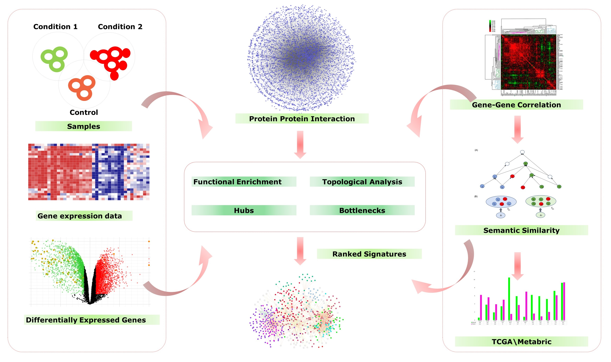

## Candidate Gene Identification from Gene Expression Data


```python

```

 


```python

```

### 1. Selection of the base Genes
The curated genes from various studies related to the disease or condition of interest **(BASE GENES)**

### 2. Collection of Gene Expression Data
The microarray gene expression profile of disease of interest was taken from the GEO database (www.ncbi.nlm.nih.gov/geo)

### 3. Data Normalization and Analysis
1. Analysis of microarray gene expression data was carried out by using R/Bioconductor. <br>
2. Normalization of the microarray dataset was performed using Robust Multiarray Average (RMA) algorithm <br>
3. Statistically significant differentially expressed genes between normal and RA samples were computed by applying t-statistic.<br>

### 4. Protein-Protein Interaction Map
An experimentally validated protein–protein interaction map **(PPIM)** was constructed using data deposited in the Biomolecular Interaction Network Database (**BIND**), Biological General Repository for Interaction Datasets (**BioGRID**), The Molecular Interaction Database (**MINT**), Database of Interacting Proteins (**DIP**), Human Protein Reference Database (**HPRD**), and **IntAct** database

### 5. Toplogical parameters (Optional)
Apply topological parameters (Degree, betweenness) based on Graph theory to subset the genes as hubs and bottlenecks

### 6. Construction of Sub-Network
The subnetwork was created by extracting **BASE GENES** and its connected partners from the PPIM.

### 7. Identification of pairwise gene correlation
Pearson’s correlation algorithm was applied to the genes of 'Sub-Network' to create a weighted gene correlation map based on Pearson's Correlation Coefficient (PCC). 

- Expression of gene pairs with high correlation. Gene pairs with PCC r ≥ 0.8  from the correlation map were chosen for the analysis for both healthy and disease, as a higher r score represents stronger association

### 8. Semantic Similarity Between Gene Pairs
Functional resemblance among two genes is evaluated using prearranged data available in Gene Ontology. To evaluate the functional similarity between two genes, Wang’s measure of semantic similarity was applied to molecular function (MF) hierarchy as MF, which specifically defines a particular gene in terms of functional ontology. The semantic score of functional similarity between genes range from 0 to 1. Higher semantic score between genes represents a stronger functional relationship among the genes

### 9. Functional annotation
Functional annotation is performed to gain insights into the high-throughput biological data. This method not only authenticates the new genes found in biological experiment as functionally significant but also uncovers the biological interactions among them.

### Reference

1. [A computational framework for the prioritization of disease-gene candidates](https://bmcgenomics.biomedcentral.com/articles/10.1186/1471-2164-16-S9-S2) <br>

2. [Identification of key regulatory genes connected to NF-κB family of proteins in visceral adipose tissues using gene expression and weighted protein interaction network](http://www.ncbi.nlm.nih.gov/pmc/articles/pmc6478283/) <br>

3. [Construction and analysis of the protein-protein interaction networks based on gene expression profiles of Parkinson’s disease](https://doi.org/10.1371/journal.pone.0103047) <br>
