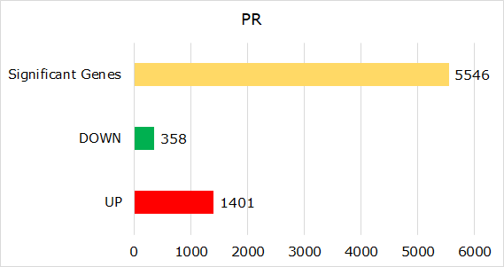
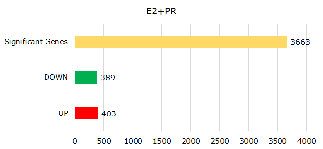
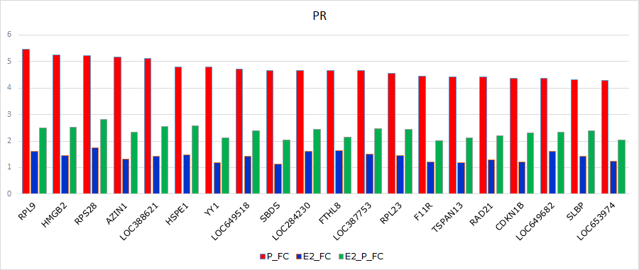
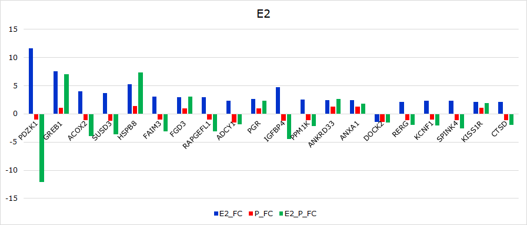

```python
import pandas as pd
```


```python
pr_data = pd.read_excel(r"F:\snijesh\OneDrive - St John's National Academy of Health Sciences\Re_analysis\SNJ_WorkingDirectory\GSE61368\PR\PR_filtered.xlsx", sep="\t")
pr_data
```


<div>

</style>
<table border="1" class="dataframe">
  <thead>
    <tr style="text-align: right;">
      <th></th>
      <th>Probe</th>
      <th>p.value.P</th>
      <th>Gene</th>
      <th>Entrez_id</th>
      <th>P_FC_ABS</th>
      <th>P_FC</th>
      <th>E2_P_FC</th>
      <th>E2_FC</th>
      <th>IS_BASE</th>
    </tr>
  </thead>
  <tbody>
    <tr>
      <td>0</td>
      <td>ILMN_1754579</td>
      <td>0.000003</td>
      <td>SYNE2</td>
      <td>23224</td>
      <td>1.611551</td>
      <td>-1.611551</td>
      <td>-1.449689</td>
      <td>-1.334159</td>
      <td>0</td>
    </tr>
    <tr>
      <td>1</td>
      <td>ILMN_2271149</td>
      <td>0.000006</td>
      <td>PGM5</td>
      <td>5239</td>
      <td>1.563075</td>
      <td>-1.563075</td>
      <td>-2.038934</td>
      <td>-2.213045</td>
      <td>0</td>
    </tr>
    <tr>
      <td>2</td>
      <td>ILMN_1669057</td>
      <td>0.000011</td>
      <td>LOC642921</td>
      <td>642921</td>
      <td>1.561260</td>
      <td>-1.561260</td>
      <td>-1.353780</td>
      <td>-1.232359</td>
      <td>0</td>
    </tr>
    <tr>
      <td>3</td>
      <td>ILMN_1741711</td>
      <td>0.000011</td>
      <td>DOPEY2</td>
      <td>9980</td>
      <td>1.680760</td>
      <td>-1.680760</td>
      <td>-1.409012</td>
      <td>-1.320791</td>
      <td>0</td>
    </tr>
    <tr>
      <td>4</td>
      <td>ILMN_1740742</td>
      <td>0.000014</td>
      <td>UROD</td>
      <td>7389</td>
      <td>1.426449</td>
      <td>1.426449</td>
      <td>1.339596</td>
      <td>1.251000</td>
      <td>0</td>
    </tr>
    <tr>
      <td>...</td>
      <td>...</td>
      <td>...</td>
      <td>...</td>
      <td>...</td>
      <td>...</td>
      <td>...</td>
      <td>...</td>
      <td>...</td>
      <td>...</td>
    </tr>
    <tr>
      <td>5541</td>
      <td>ILMN_1797776</td>
      <td>0.958477</td>
      <td>PRSS23</td>
      <td>11098</td>
      <td>1.003470</td>
      <td>1.003470</td>
      <td>1.103503</td>
      <td>1.068774</td>
      <td>1</td>
    </tr>
    <tr>
      <td>5542</td>
      <td>ILMN_1765258</td>
      <td>0.972373</td>
      <td>HLA-E</td>
      <td>3133</td>
      <td>1.004411</td>
      <td>-1.004411</td>
      <td>-1.027867</td>
      <td>-1.005112</td>
      <td>1</td>
    </tr>
    <tr>
      <td>5543</td>
      <td>ILMN_2148193</td>
      <td>0.978980</td>
      <td>MPPED2</td>
      <td>744</td>
      <td>1.002070</td>
      <td>1.002070</td>
      <td>1.148964</td>
      <td>1.092891</td>
      <td>1</td>
    </tr>
    <tr>
      <td>5544</td>
      <td>ILMN_1753790</td>
      <td>0.989904</td>
      <td>ZNF259</td>
      <td>8882</td>
      <td>1.000878</td>
      <td>-1.000878</td>
      <td>-1.059168</td>
      <td>1.075312</td>
      <td>1</td>
    </tr>
    <tr>
      <td>5545</td>
      <td>ILMN_1736939</td>
      <td>0.995970</td>
      <td>UGCG</td>
      <td>7357</td>
      <td>1.000606</td>
      <td>-1.000606</td>
      <td>-1.218613</td>
      <td>1.236134</td>
      <td>1</td>
    </tr>
  </tbody>
</table>
<p>5546 rows × 9 columns</p>
</div>


```python
print("Total Number of Significant Genes:", pr_data.shape[0])
print("\nUpregulated:", (pr_data[pr_data['P_FC']>=1.4]).shape[0])
print("\nDownregulated:", (pr_data[pr_data['P_FC']<=-1.4]).shape[0])
```

    Total Number of Significant Genes: 5546
    
    Upregulated: 1401
    
    Downregulated: 358
    


```python
ppi = pd.read_table(r"F:\snijesh\OneDrive - St John's National Academy of Health Sciences\Re_analysis\Hippie\hippie_current.txt", sep="\t")
ppi
```


<div>

</style>
<table border="1" class="dataframe">
  <thead>
    <tr style="text-align: right;">
      <th></th>
      <th>Gene1</th>
      <th>EntrezID1</th>
      <th>Gene2</th>
      <th>EntrezID2</th>
      <th>Score</th>
      <th>Reference</th>
    </tr>
  </thead>
  <tbody>
    <tr>
      <td>0</td>
      <td>AL1A1_HUMAN</td>
      <td>216</td>
      <td>AL1A1_HUMAN</td>
      <td>216</td>
      <td>0.76</td>
      <td>experiments:in vivo,Two-hybrid;pmids:12081471,...</td>
    </tr>
    <tr>
      <td>1</td>
      <td>ITA7_HUMAN</td>
      <td>3679</td>
      <td>ACHA_HUMAN</td>
      <td>1134</td>
      <td>0.73</td>
      <td>experiments:in vivo,Affinity Capture-Western,a...</td>
    </tr>
    <tr>
      <td>2</td>
      <td>NEB1_HUMAN</td>
      <td>55607</td>
      <td>ACTG_HUMAN</td>
      <td>71</td>
      <td>0.65</td>
      <td>experiments:in vitro,in vivo;pmids:9362513,120...</td>
    </tr>
    <tr>
      <td>3</td>
      <td>SRGN_HUMAN</td>
      <td>5552</td>
      <td>CD44_HUMAN</td>
      <td>960</td>
      <td>0.63</td>
      <td>experiments:in vivo;pmids:9334256,16189514,167...</td>
    </tr>
    <tr>
      <td>4</td>
      <td>GRB7_HUMAN</td>
      <td>2886</td>
      <td>ERBB2_HUMAN</td>
      <td>2064</td>
      <td>0.90</td>
      <td>experiments:in vitro,in vivo,Reconstituted Com...</td>
    </tr>
    <tr>
      <td>...</td>
      <td>...</td>
      <td>...</td>
      <td>...</td>
      <td>...</td>
      <td>...</td>
      <td>...</td>
    </tr>
    <tr>
      <td>411425</td>
      <td>CH60_HUMAN</td>
      <td>3329</td>
      <td>RM41_HUMAN</td>
      <td>64975</td>
      <td>0.49</td>
      <td>pmids:29568061;sources:IntAct</td>
    </tr>
    <tr>
      <td>411426</td>
      <td>CS010_HUMAN</td>
      <td>56005</td>
      <td>MTL5_HUMAN</td>
      <td>9633</td>
      <td>0.63</td>
      <td>experiments:cross-linking study;pmids:30021884...</td>
    </tr>
    <tr>
      <td>411427</td>
      <td>KI67_HUMAN</td>
      <td>4288</td>
      <td>C1TM_HUMAN</td>
      <td>25902</td>
      <td>0.63</td>
      <td>experiments:anti tag coimmunoprecipitation;pmi...</td>
    </tr>
    <tr>
      <td>411428</td>
      <td>DUX4_HUMAN</td>
      <td>22947</td>
      <td>TBB2A_HUMAN</td>
      <td>7280</td>
      <td>0.56</td>
      <td>experiments:pull down;pmids:26816005;sources:I...</td>
    </tr>
    <tr>
      <td>411429</td>
      <td>DICER_HUMAN</td>
      <td>23405</td>
      <td>ADT2_HUMAN</td>
      <td>292</td>
      <td>0.63</td>
      <td>experiments:anti tag coimmunoprecipitation;pmi...</td>
    </tr>
  </tbody>
</table>
<p>411430 rows × 6 columns</p>
</div>


```python
pr_data.columns
```


    Index(['Probe', 'p.value.P', 'Gene', 'Entrez_id', 'P_FC_ABS', 'P_FC',
           'E2_P_FC', 'E2_FC', 'IS_BASE'],
          dtype='object')


```python
#Extracting all interactions of 
df = ppi[ppi['EntrezID1'].isin(pr_data['Entrez_id']) | ppi['EntrezID2'].isin(pr_data['Entrez_id'])]
df
```


<div>

</style>
<table border="1" class="dataframe">
  <thead>
    <tr style="text-align: right;">
      <th></th>
      <th>Gene1</th>
      <th>EntrezID1</th>
      <th>Gene2</th>
      <th>EntrezID2</th>
      <th>Score</th>
      <th>Reference</th>
    </tr>
  </thead>
  <tbody>
    <tr>
      <td>3</td>
      <td>SRGN_HUMAN</td>
      <td>5552</td>
      <td>CD44_HUMAN</td>
      <td>960</td>
      <td>0.63</td>
      <td>experiments:in vivo;pmids:9334256,16189514,167...</td>
    </tr>
    <tr>
      <td>5</td>
      <td>PAK1_HUMAN</td>
      <td>5058</td>
      <td>ERBB2_HUMAN</td>
      <td>2064</td>
      <td>0.73</td>
      <td>experiments:in vivo,Affinity Capture-Western,a...</td>
    </tr>
    <tr>
      <td>7</td>
      <td>P85B_HUMAN</td>
      <td>5296</td>
      <td>ERBB2_HUMAN</td>
      <td>2064</td>
      <td>0.89</td>
      <td>experiments:in vivo,Reconstituted Complex,Bioc...</td>
    </tr>
    <tr>
      <td>10</td>
      <td>SMUF2_HUMAN</td>
      <td>64750</td>
      <td>RHG05_HUMAN</td>
      <td>394</td>
      <td>0.88</td>
      <td>experiments:Two-hybrid,affinity chromatography...</td>
    </tr>
    <tr>
      <td>11</td>
      <td>MERL_HUMAN</td>
      <td>4771</td>
      <td>ERBB2_HUMAN</td>
      <td>2064</td>
      <td>0.79</td>
      <td>experiments:in vitro,in vivo,fluorescent reson...</td>
    </tr>
    <tr>
      <td>...</td>
      <td>...</td>
      <td>...</td>
      <td>...</td>
      <td>...</td>
      <td>...</td>
      <td>...</td>
    </tr>
    <tr>
      <td>411425</td>
      <td>CH60_HUMAN</td>
      <td>3329</td>
      <td>RM41_HUMAN</td>
      <td>64975</td>
      <td>0.49</td>
      <td>pmids:29568061;sources:IntAct</td>
    </tr>
    <tr>
      <td>411426</td>
      <td>CS010_HUMAN</td>
      <td>56005</td>
      <td>MTL5_HUMAN</td>
      <td>9633</td>
      <td>0.63</td>
      <td>experiments:cross-linking study;pmids:30021884...</td>
    </tr>
    <tr>
      <td>411427</td>
      <td>KI67_HUMAN</td>
      <td>4288</td>
      <td>C1TM_HUMAN</td>
      <td>25902</td>
      <td>0.63</td>
      <td>experiments:anti tag coimmunoprecipitation;pmi...</td>
    </tr>
    <tr>
      <td>411428</td>
      <td>DUX4_HUMAN</td>
      <td>22947</td>
      <td>TBB2A_HUMAN</td>
      <td>7280</td>
      <td>0.56</td>
      <td>experiments:pull down;pmids:26816005;sources:I...</td>
    </tr>
    <tr>
      <td>411429</td>
      <td>DICER_HUMAN</td>
      <td>23405</td>
      <td>ADT2_HUMAN</td>
      <td>292</td>
      <td>0.63</td>
      <td>experiments:anti tag coimmunoprecipitation;pmi...</td>
    </tr>
  </tbody>
</table>
<p>237425 rows × 6 columns</p>
</div>


```python
#filter mapped ppi by score 04
df4=df[df['Score']>=0.4]
df4
```


<div>

</style>
<table border="1" class="dataframe">
  <thead>
    <tr style="text-align: right;">
      <th></th>
      <th>Gene1</th>
      <th>EntrezID1</th>
      <th>Gene2</th>
      <th>EntrezID2</th>
      <th>Score</th>
      <th>Reference</th>
    </tr>
  </thead>
  <tbody>
    <tr>
      <td>3</td>
      <td>SRGN_HUMAN</td>
      <td>5552</td>
      <td>CD44_HUMAN</td>
      <td>960</td>
      <td>0.63</td>
      <td>experiments:in vivo;pmids:9334256,16189514,167...</td>
    </tr>
    <tr>
      <td>5</td>
      <td>PAK1_HUMAN</td>
      <td>5058</td>
      <td>ERBB2_HUMAN</td>
      <td>2064</td>
      <td>0.73</td>
      <td>experiments:in vivo,Affinity Capture-Western,a...</td>
    </tr>
    <tr>
      <td>7</td>
      <td>P85B_HUMAN</td>
      <td>5296</td>
      <td>ERBB2_HUMAN</td>
      <td>2064</td>
      <td>0.89</td>
      <td>experiments:in vivo,Reconstituted Complex,Bioc...</td>
    </tr>
    <tr>
      <td>10</td>
      <td>SMUF2_HUMAN</td>
      <td>64750</td>
      <td>RHG05_HUMAN</td>
      <td>394</td>
      <td>0.88</td>
      <td>experiments:Two-hybrid,affinity chromatography...</td>
    </tr>
    <tr>
      <td>11</td>
      <td>MERL_HUMAN</td>
      <td>4771</td>
      <td>ERBB2_HUMAN</td>
      <td>2064</td>
      <td>0.79</td>
      <td>experiments:in vitro,in vivo,fluorescent reson...</td>
    </tr>
    <tr>
      <td>...</td>
      <td>...</td>
      <td>...</td>
      <td>...</td>
      <td>...</td>
      <td>...</td>
      <td>...</td>
    </tr>
    <tr>
      <td>411425</td>
      <td>CH60_HUMAN</td>
      <td>3329</td>
      <td>RM41_HUMAN</td>
      <td>64975</td>
      <td>0.49</td>
      <td>pmids:29568061;sources:IntAct</td>
    </tr>
    <tr>
      <td>411426</td>
      <td>CS010_HUMAN</td>
      <td>56005</td>
      <td>MTL5_HUMAN</td>
      <td>9633</td>
      <td>0.63</td>
      <td>experiments:cross-linking study;pmids:30021884...</td>
    </tr>
    <tr>
      <td>411427</td>
      <td>KI67_HUMAN</td>
      <td>4288</td>
      <td>C1TM_HUMAN</td>
      <td>25902</td>
      <td>0.63</td>
      <td>experiments:anti tag coimmunoprecipitation;pmi...</td>
    </tr>
    <tr>
      <td>411428</td>
      <td>DUX4_HUMAN</td>
      <td>22947</td>
      <td>TBB2A_HUMAN</td>
      <td>7280</td>
      <td>0.56</td>
      <td>experiments:pull down;pmids:26816005;sources:I...</td>
    </tr>
    <tr>
      <td>411429</td>
      <td>DICER_HUMAN</td>
      <td>23405</td>
      <td>ADT2_HUMAN</td>
      <td>292</td>
      <td>0.63</td>
      <td>experiments:anti tag coimmunoprecipitation;pmi...</td>
    </tr>
  </tbody>
</table>
<p>234330 rows × 6 columns</p>
</div>


```python
df4.to_csv(r"F:\snijesh\OneDrive - St John's National Academy of Health Sciences\Re_analysis\SNJ_WorkingDirectory\GSE61368\PR\PR_ppi.txt", sep="\t", index=False)

```


```python

```


```python
#Semantic Similarity
pr_ss = pd.read_table(r"F:\snijesh\OneDrive - St John's National Academy of Health Sciences\Re_analysis\SNJ_WorkingDirectory\GSE61368\PR\result_pr_mf.txt", sep="\t")
pr_ss
```


<div>

</style>
<table border="1" class="dataframe">
  <thead>
    <tr style="text-align: right;">
      <th></th>
      <th>Var1</th>
      <th>Var2</th>
      <th>Freq</th>
    </tr>
  </thead>
  <tbody>
    <tr>
      <td>1</td>
      <td>4771</td>
      <td>4771</td>
      <td>1.000</td>
    </tr>
    <tr>
      <td>2</td>
      <td>2274</td>
      <td>4771</td>
      <td>1.000</td>
    </tr>
    <tr>
      <td>3</td>
      <td>1432</td>
      <td>4771</td>
      <td>1.000</td>
    </tr>
    <tr>
      <td>4</td>
      <td>4089</td>
      <td>4771</td>
      <td>1.000</td>
    </tr>
    <tr>
      <td>5</td>
      <td>4088</td>
      <td>4771</td>
      <td>1.000</td>
    </tr>
    <tr>
      <td>...</td>
      <td>...</td>
      <td>...</td>
      <td>...</td>
    </tr>
    <tr>
      <td>12355221</td>
      <td>9</td>
      <td>9469</td>
      <td>0.289</td>
    </tr>
    <tr>
      <td>12355222</td>
      <td>171586</td>
      <td>9469</td>
      <td>0.228</td>
    </tr>
    <tr>
      <td>12355223</td>
      <td>60481</td>
      <td>9469</td>
      <td>0.286</td>
    </tr>
    <tr>
      <td>12355224</td>
      <td>79153</td>
      <td>9469</td>
      <td>0.208</td>
    </tr>
    <tr>
      <td>12355225</td>
      <td>9469</td>
      <td>9469</td>
      <td>1.000</td>
    </tr>
  </tbody>
</table>
<p>12355225 rows × 3 columns</p>
</div>


```python
pr_sel = pd.read_table(r"F:\snijesh\OneDrive - St John's National Academy of Health Sciences\Re_analysis\SNJ_WorkingDirectory\GSE61368\PR\pr_sel_fc.txt", sep="\t")
pr_sel
```


<div>

</style>
<table border="1" class="dataframe">
  <thead>
    <tr style="text-align: right;">
      <th></th>
      <th>EntrezID1</th>
      <th>EntrezID2</th>
      <th>Score</th>
      <th>SIG1</th>
      <th>SIG2</th>
      <th>FC1</th>
      <th>FC2</th>
      <th>F1ABS</th>
      <th>F2ABS</th>
    </tr>
  </thead>
  <tbody>
    <tr>
      <td>0</td>
      <td>1432</td>
      <td>3726</td>
      <td>0.62</td>
      <td>1</td>
      <td>0</td>
      <td>-1.520939</td>
      <td>-1.321741</td>
      <td>1.520939</td>
      <td>1.321741</td>
    </tr>
    <tr>
      <td>1</td>
      <td>7322</td>
      <td>867</td>
      <td>0.90</td>
      <td>1</td>
      <td>1</td>
      <td>1.400684</td>
      <td>-1.374758</td>
      <td>1.400684</td>
      <td>1.374758</td>
    </tr>
    <tr>
      <td>2</td>
      <td>5111</td>
      <td>595</td>
      <td>0.89</td>
      <td>1</td>
      <td>1</td>
      <td>3.239059</td>
      <td>-1.064044</td>
      <td>3.239059</td>
      <td>1.064044</td>
    </tr>
    <tr>
      <td>3</td>
      <td>367</td>
      <td>595</td>
      <td>0.90</td>
      <td>2</td>
      <td>1</td>
      <td>-1.454429</td>
      <td>-1.064044</td>
      <td>1.454429</td>
      <td>1.064044</td>
    </tr>
    <tr>
      <td>4</td>
      <td>2033</td>
      <td>595</td>
      <td>0.87</td>
      <td>1</td>
      <td>1</td>
      <td>-1.433831</td>
      <td>-1.064044</td>
      <td>1.433831</td>
      <td>1.064044</td>
    </tr>
    <tr>
      <td>...</td>
      <td>...</td>
      <td>...</td>
      <td>...</td>
      <td>...</td>
      <td>...</td>
      <td>...</td>
      <td>...</td>
      <td>...</td>
      <td>...</td>
    </tr>
    <tr>
      <td>18260</td>
      <td>23394</td>
      <td>6160</td>
      <td>0.63</td>
      <td>0</td>
      <td>1</td>
      <td>-1.344591</td>
      <td>1.623281</td>
      <td>1.344591</td>
      <td>1.623281</td>
    </tr>
    <tr>
      <td>18261</td>
      <td>3105</td>
      <td>4343</td>
      <td>0.72</td>
      <td>0</td>
      <td>1</td>
      <td>1.164681</td>
      <td>-1.424579</td>
      <td>1.164681</td>
      <td>1.424579</td>
    </tr>
    <tr>
      <td>18262</td>
      <td>23405</td>
      <td>3329</td>
      <td>0.63</td>
      <td>0</td>
      <td>1</td>
      <td>-1.376904</td>
      <td>2.070197</td>
      <td>1.376904</td>
      <td>2.070197</td>
    </tr>
    <tr>
      <td>18263</td>
      <td>2861</td>
      <td>664</td>
      <td>0.63</td>
      <td>0</td>
      <td>1</td>
      <td>-1.261665</td>
      <td>1.709453</td>
      <td>1.261665</td>
      <td>1.709453</td>
    </tr>
    <tr>
      <td>18264</td>
      <td>22861</td>
      <td>5610</td>
      <td>0.63</td>
      <td>0</td>
      <td>1</td>
      <td>1.109178</td>
      <td>1.561835</td>
      <td>1.109178</td>
      <td>1.561835</td>
    </tr>
  </tbody>
</table>
<p>18265 rows × 9 columns</p>
</div>


```python
edge_semantic_map_pr = pd.merge(pr_sel,pr_ss, left_on=['EntrezID1','EntrezID2'], right_on=['Var1', 'Var2'],how ='left')
edge_semantic_map_pr
```


<div>

</style>
<table border="1" class="dataframe">
  <thead>
    <tr style="text-align: right;">
      <th></th>
      <th>EntrezID1</th>
      <th>EntrezID2</th>
      <th>Score</th>
      <th>SIG1</th>
      <th>SIG2</th>
      <th>FC1</th>
      <th>FC2</th>
      <th>F1ABS</th>
      <th>F2ABS</th>
      <th>Var1</th>
      <th>Var2</th>
      <th>Freq</th>
    </tr>
  </thead>
  <tbody>
    <tr>
      <td>0</td>
      <td>1432</td>
      <td>3726</td>
      <td>0.62</td>
      <td>1</td>
      <td>0</td>
      <td>-1.520939</td>
      <td>-1.321741</td>
      <td>1.520939</td>
      <td>1.321741</td>
      <td>1432.0</td>
      <td>3726.0</td>
      <td>0.472</td>
    </tr>
    <tr>
      <td>1</td>
      <td>7322</td>
      <td>867</td>
      <td>0.90</td>
      <td>1</td>
      <td>1</td>
      <td>1.400684</td>
      <td>-1.374758</td>
      <td>1.400684</td>
      <td>1.374758</td>
      <td>7322.0</td>
      <td>867.0</td>
      <td>0.791</td>
    </tr>
    <tr>
      <td>2</td>
      <td>5111</td>
      <td>595</td>
      <td>0.89</td>
      <td>1</td>
      <td>1</td>
      <td>3.239059</td>
      <td>-1.064044</td>
      <td>3.239059</td>
      <td>1.064044</td>
      <td>5111.0</td>
      <td>595.0</td>
      <td>0.642</td>
    </tr>
    <tr>
      <td>3</td>
      <td>367</td>
      <td>595</td>
      <td>0.90</td>
      <td>2</td>
      <td>1</td>
      <td>-1.454429</td>
      <td>-1.064044</td>
      <td>1.454429</td>
      <td>1.064044</td>
      <td>367.0</td>
      <td>595.0</td>
      <td>0.579</td>
    </tr>
    <tr>
      <td>4</td>
      <td>2033</td>
      <td>595</td>
      <td>0.87</td>
      <td>1</td>
      <td>1</td>
      <td>-1.433831</td>
      <td>-1.064044</td>
      <td>1.433831</td>
      <td>1.064044</td>
      <td>2033.0</td>
      <td>595.0</td>
      <td>0.540</td>
    </tr>
    <tr>
      <td>...</td>
      <td>...</td>
      <td>...</td>
      <td>...</td>
      <td>...</td>
      <td>...</td>
      <td>...</td>
      <td>...</td>
      <td>...</td>
      <td>...</td>
      <td>...</td>
      <td>...</td>
      <td>...</td>
    </tr>
    <tr>
      <td>18260</td>
      <td>23394</td>
      <td>6160</td>
      <td>0.63</td>
      <td>0</td>
      <td>1</td>
      <td>-1.344591</td>
      <td>1.623281</td>
      <td>1.344591</td>
      <td>1.623281</td>
      <td>23394.0</td>
      <td>6160.0</td>
      <td>0.569</td>
    </tr>
    <tr>
      <td>18261</td>
      <td>3105</td>
      <td>4343</td>
      <td>0.72</td>
      <td>0</td>
      <td>1</td>
      <td>1.164681</td>
      <td>-1.424579</td>
      <td>1.164681</td>
      <td>1.424579</td>
      <td>3105.0</td>
      <td>4343.0</td>
      <td>0.765</td>
    </tr>
    <tr>
      <td>18262</td>
      <td>23405</td>
      <td>3329</td>
      <td>0.63</td>
      <td>0</td>
      <td>1</td>
      <td>-1.376904</td>
      <td>2.070197</td>
      <td>1.376904</td>
      <td>2.070197</td>
      <td>23405.0</td>
      <td>3329.0</td>
      <td>0.665</td>
    </tr>
    <tr>
      <td>18263</td>
      <td>2861</td>
      <td>664</td>
      <td>0.63</td>
      <td>0</td>
      <td>1</td>
      <td>-1.261665</td>
      <td>1.709453</td>
      <td>1.261665</td>
      <td>1.709453</td>
      <td>2861.0</td>
      <td>664.0</td>
      <td>0.599</td>
    </tr>
    <tr>
      <td>18264</td>
      <td>22861</td>
      <td>5610</td>
      <td>0.63</td>
      <td>0</td>
      <td>1</td>
      <td>1.109178</td>
      <td>1.561835</td>
      <td>1.109178</td>
      <td>1.561835</td>
      <td>22861.0</td>
      <td>5610.0</td>
      <td>0.496</td>
    </tr>
  </tbody>
</table>
<p>18265 rows × 12 columns</p>
</div>


```python
mappr = edge_semantic_map_pr[edge_semantic_map_pr['Freq']>=0.5]
```


```python
mappr.to_csv(r"F:\snijesh\OneDrive - St John's National Academy of Health Sciences\Re_analysis\SNJ_WorkingDirectory\GSE61368\PR\pr_sem_s5.txt", sep="\t", index=False)
```


```python
mappr
```


<div>

</style>
<table border="1" class="dataframe">
  <thead>
    <tr style="text-align: right;">
      <th></th>
      <th>EntrezID1</th>
      <th>EntrezID2</th>
      <th>Score</th>
      <th>SIG1</th>
      <th>SIG2</th>
      <th>FC1</th>
      <th>FC2</th>
      <th>F1ABS</th>
      <th>F2ABS</th>
      <th>Var1</th>
      <th>Var2</th>
      <th>Freq</th>
    </tr>
  </thead>
  <tbody>
    <tr>
      <td>1</td>
      <td>7322</td>
      <td>867</td>
      <td>0.90</td>
      <td>1</td>
      <td>1</td>
      <td>1.400684</td>
      <td>-1.374758</td>
      <td>1.400684</td>
      <td>1.374758</td>
      <td>7322.0</td>
      <td>867.0</td>
      <td>0.791</td>
    </tr>
    <tr>
      <td>2</td>
      <td>5111</td>
      <td>595</td>
      <td>0.89</td>
      <td>1</td>
      <td>1</td>
      <td>3.239059</td>
      <td>-1.064044</td>
      <td>3.239059</td>
      <td>1.064044</td>
      <td>5111.0</td>
      <td>595.0</td>
      <td>0.642</td>
    </tr>
    <tr>
      <td>3</td>
      <td>367</td>
      <td>595</td>
      <td>0.90</td>
      <td>2</td>
      <td>1</td>
      <td>-1.454429</td>
      <td>-1.064044</td>
      <td>1.454429</td>
      <td>1.064044</td>
      <td>367.0</td>
      <td>595.0</td>
      <td>0.579</td>
    </tr>
    <tr>
      <td>4</td>
      <td>2033</td>
      <td>595</td>
      <td>0.87</td>
      <td>1</td>
      <td>1</td>
      <td>-1.433831</td>
      <td>-1.064044</td>
      <td>1.433831</td>
      <td>1.064044</td>
      <td>2033.0</td>
      <td>595.0</td>
      <td>0.540</td>
    </tr>
    <tr>
      <td>5</td>
      <td>7529</td>
      <td>6548</td>
      <td>0.86</td>
      <td>1</td>
      <td>0</td>
      <td>1.660226</td>
      <td>-1.291156</td>
      <td>1.660226</td>
      <td>1.291156</td>
      <td>7529.0</td>
      <td>6548.0</td>
      <td>0.574</td>
    </tr>
    <tr>
      <td>...</td>
      <td>...</td>
      <td>...</td>
      <td>...</td>
      <td>...</td>
      <td>...</td>
      <td>...</td>
      <td>...</td>
      <td>...</td>
      <td>...</td>
      <td>...</td>
      <td>...</td>
      <td>...</td>
    </tr>
    <tr>
      <td>18258</td>
      <td>6772</td>
      <td>55818</td>
      <td>0.75</td>
      <td>0</td>
      <td>1</td>
      <td>-1.227815</td>
      <td>2.422259</td>
      <td>1.227815</td>
      <td>2.422259</td>
      <td>6772.0</td>
      <td>55818.0</td>
      <td>0.625</td>
    </tr>
    <tr>
      <td>18260</td>
      <td>23394</td>
      <td>6160</td>
      <td>0.63</td>
      <td>0</td>
      <td>1</td>
      <td>-1.344591</td>
      <td>1.623281</td>
      <td>1.344591</td>
      <td>1.623281</td>
      <td>23394.0</td>
      <td>6160.0</td>
      <td>0.569</td>
    </tr>
    <tr>
      <td>18261</td>
      <td>3105</td>
      <td>4343</td>
      <td>0.72</td>
      <td>0</td>
      <td>1</td>
      <td>1.164681</td>
      <td>-1.424579</td>
      <td>1.164681</td>
      <td>1.424579</td>
      <td>3105.0</td>
      <td>4343.0</td>
      <td>0.765</td>
    </tr>
    <tr>
      <td>18262</td>
      <td>23405</td>
      <td>3329</td>
      <td>0.63</td>
      <td>0</td>
      <td>1</td>
      <td>-1.376904</td>
      <td>2.070197</td>
      <td>1.376904</td>
      <td>2.070197</td>
      <td>23405.0</td>
      <td>3329.0</td>
      <td>0.665</td>
    </tr>
    <tr>
      <td>18263</td>
      <td>2861</td>
      <td>664</td>
      <td>0.63</td>
      <td>0</td>
      <td>1</td>
      <td>-1.261665</td>
      <td>1.709453</td>
      <td>1.261665</td>
      <td>1.709453</td>
      <td>2861.0</td>
      <td>664.0</td>
      <td>0.599</td>
    </tr>
  </tbody>
</table>
<p>13364 rows × 12 columns</p>
</div>


```python
pr_degs = pd.read_table(r"F:\snijesh\OneDrive - St John's National Academy of Health Sciences\Re_analysis\SNJ_WorkingDirectory\GSE61368\PR\p2_degs.txt", sep="\t")
pr_degs.head(4)
```


<div>

</style>
<table border="1" class="dataframe">
  <thead>
    <tr style="text-align: right;">
      <th></th>
      <th>Gene</th>
      <th>Entrez_id</th>
      <th>P_FC_ABS</th>
      <th>P_FC</th>
    </tr>
  </thead>
  <tbody>
    <tr>
      <td>0</td>
      <td>SYNE2</td>
      <td>23224</td>
      <td>1.611551</td>
      <td>-1.611551</td>
    </tr>
    <tr>
      <td>1</td>
      <td>PGM5</td>
      <td>5239</td>
      <td>1.563075</td>
      <td>-1.563075</td>
    </tr>
    <tr>
      <td>2</td>
      <td>LOC642921</td>
      <td>642921</td>
      <td>1.561260</td>
      <td>-1.561260</td>
    </tr>
    <tr>
      <td>3</td>
      <td>DOPEY2</td>
      <td>9980</td>
      <td>1.680760</td>
      <td>-1.680760</td>
    </tr>
  </tbody>
</table>
</div>


```python
pr_degs['P_FC_ABS'].quantile([0.33, 0.66])
```


    0.33    1.538182
    0.66    1.907564
    Name: P_FC_ABS, dtype: float64


```python
len(pr_degs[pr_degs['P_FC_ABS'] >=1.907564]) #Higher Confidence
```


    598


```python

```


```python

```


```python
### E2 P2
```


```python
e2p2 = pd.read_excel(r"F:\snijesh\OneDrive - St John's National Academy of Health Sciences\Re_analysis\SNJ_WorkingDirectory\GSE61368\PR\E2+PR_filtered.xlsx")
e2p2
```


<div>

</style>
<table border="1" class="dataframe">
  <thead>
    <tr style="text-align: right;">
      <th></th>
      <th>Probe</th>
      <th>p.value.E2_P</th>
      <th>Gene</th>
      <th>Entrez_id</th>
      <th>E2_P_FC</th>
      <th>P_FC</th>
      <th>E2_FC</th>
      <th>IS_BASE</th>
    </tr>
  </thead>
  <tbody>
    <tr>
      <td>0</td>
      <td>ILMN_1708341</td>
      <td>6.921678e-19</td>
      <td>PDZK1</td>
      <td>5174</td>
      <td>-12.109649</td>
      <td>-1.000698</td>
      <td>11.691604</td>
      <td>0</td>
    </tr>
    <tr>
      <td>1</td>
      <td>ILMN_1765578</td>
      <td>6.494075e-16</td>
      <td>TIPARP</td>
      <td>25976</td>
      <td>2.863815</td>
      <td>1.119104</td>
      <td>2.570842</td>
      <td>1</td>
    </tr>
    <tr>
      <td>2</td>
      <td>ILMN_2354391</td>
      <td>4.440495e-15</td>
      <td>EGLN2</td>
      <td>112398</td>
      <td>2.479170</td>
      <td>1.040790</td>
      <td>2.519106</td>
      <td>0</td>
    </tr>
    <tr>
      <td>3</td>
      <td>ILMN_1758613</td>
      <td>5.601048e-15</td>
      <td>RAPGEFL1</td>
      <td>51195</td>
      <td>-3.108063</td>
      <td>-1.030184</td>
      <td>2.934882</td>
      <td>0</td>
    </tr>
    <tr>
      <td>4</td>
      <td>ILMN_1785570</td>
      <td>6.200038e-15</td>
      <td>SUSD3</td>
      <td>203328</td>
      <td>-3.663183</td>
      <td>-1.253668</td>
      <td>3.725140</td>
      <td>0</td>
    </tr>
    <tr>
      <td>...</td>
      <td>...</td>
      <td>...</td>
      <td>...</td>
      <td>...</td>
      <td>...</td>
      <td>...</td>
      <td>...</td>
      <td>...</td>
    </tr>
    <tr>
      <td>3658</td>
      <td>ILMN_1800317</td>
      <td>9.851156e-01</td>
      <td>WNT5A</td>
      <td>7474</td>
      <td>-1.001793</td>
      <td>-1.007108</td>
      <td>-1.119924</td>
      <td>1</td>
    </tr>
    <tr>
      <td>3659</td>
      <td>ILMN_1789224</td>
      <td>9.870784e-01</td>
      <td>FLJ21159</td>
      <td>79884</td>
      <td>1.001182</td>
      <td>1.117375</td>
      <td>-1.002410</td>
      <td>1</td>
    </tr>
    <tr>
      <td>3660</td>
      <td>ILMN_1731699</td>
      <td>9.903783e-01</td>
      <td>RAB15</td>
      <td>376267</td>
      <td>1.002329</td>
      <td>1.388127</td>
      <td>-1.062829</td>
      <td>1</td>
    </tr>
    <tr>
      <td>3661</td>
      <td>ILMN_1789123</td>
      <td>9.928481e-01</td>
      <td>PLK4</td>
      <td>10733</td>
      <td>-1.000856</td>
      <td>-1.130664</td>
      <td>1.020557</td>
      <td>1</td>
    </tr>
    <tr>
      <td>3662</td>
      <td>ILMN_1737462</td>
      <td>9.950594e-01</td>
      <td>OXR1</td>
      <td>55074</td>
      <td>-1.000518</td>
      <td>-1.036247</td>
      <td>1.010314</td>
      <td>1</td>
    </tr>
  </tbody>
</table>
<p>3663 rows × 8 columns</p>
</div>


```python
print("Total Number of Significant Genes:", e2p2.shape[0])
print("\nUpregulated:", (e2p2[e2p2['E2_P_FC']>=1.4]).shape[0])
print("\nDownregulated:", (e2p2[e2p2['E2_P_FC']<=-1.4]).shape[0])
```

    Total Number of Significant Genes: 3663
    
    Upregulated: 403
    
    Downregulated: 389
    


```python
e2p2.columns
```


    Index(['Probe', 'p.value.E2_P', 'Gene', 'Entrez_id', 'E2_P_FC', 'P_FC',
           'E2_FC', 'IS_BASE'],
          dtype='object')


```python

```


```python
#Extracting all interactions of 
dfe2p2 = ppi[ppi['EntrezID1'].isin(e2p2['Entrez_id']) | ppi['EntrezID2'].isin(e2p2['Entrez_id'])]
dfe2p2
```


<div>

</style>
<table border="1" class="dataframe">
  <thead>
    <tr style="text-align: right;">
      <th></th>
      <th>Gene1</th>
      <th>EntrezID1</th>
      <th>Gene2</th>
      <th>EntrezID2</th>
      <th>Score</th>
      <th>Reference</th>
    </tr>
  </thead>
  <tbody>
    <tr>
      <td>4</td>
      <td>GRB7_HUMAN</td>
      <td>2886</td>
      <td>ERBB2_HUMAN</td>
      <td>2064</td>
      <td>0.90</td>
      <td>experiments:in vitro,in vivo,Reconstituted Com...</td>
    </tr>
    <tr>
      <td>5</td>
      <td>PAK1_HUMAN</td>
      <td>5058</td>
      <td>ERBB2_HUMAN</td>
      <td>2064</td>
      <td>0.73</td>
      <td>experiments:in vivo,Affinity Capture-Western,a...</td>
    </tr>
    <tr>
      <td>6</td>
      <td>DLG4_HUMAN</td>
      <td>1742</td>
      <td>ERBB2_HUMAN</td>
      <td>2064</td>
      <td>0.87</td>
      <td>experiments:in vivo,Two-hybrid,Affinity Captur...</td>
    </tr>
    <tr>
      <td>7</td>
      <td>P85B_HUMAN</td>
      <td>5296</td>
      <td>ERBB2_HUMAN</td>
      <td>2064</td>
      <td>0.89</td>
      <td>experiments:in vivo,Reconstituted Complex,Bioc...</td>
    </tr>
    <tr>
      <td>8</td>
      <td>PTN18_HUMAN</td>
      <td>26469</td>
      <td>ERBB2_HUMAN</td>
      <td>2064</td>
      <td>0.88</td>
      <td>experiments:in vitro,pull down,anti tag coimmu...</td>
    </tr>
    <tr>
      <td>...</td>
      <td>...</td>
      <td>...</td>
      <td>...</td>
      <td>...</td>
      <td>...</td>
      <td>...</td>
    </tr>
    <tr>
      <td>411423</td>
      <td>MK06_HUMAN</td>
      <td>5597</td>
      <td>BOLA2_HUMAN</td>
      <td>552900</td>
      <td>0.63</td>
      <td>experiments:anti tag coimmunoprecipitation;pmi...</td>
    </tr>
    <tr>
      <td>411424</td>
      <td>MK06_HUMAN</td>
      <td>5597</td>
      <td>BOLA2_HUMAN</td>
      <td>654483</td>
      <td>0.63</td>
      <td>experiments:anti tag coimmunoprecipitation;pmi...</td>
    </tr>
    <tr>
      <td>411425</td>
      <td>CH60_HUMAN</td>
      <td>3329</td>
      <td>RM41_HUMAN</td>
      <td>64975</td>
      <td>0.49</td>
      <td>pmids:29568061;sources:IntAct</td>
    </tr>
    <tr>
      <td>411428</td>
      <td>DUX4_HUMAN</td>
      <td>22947</td>
      <td>TBB2A_HUMAN</td>
      <td>7280</td>
      <td>0.56</td>
      <td>experiments:pull down;pmids:26816005;sources:I...</td>
    </tr>
    <tr>
      <td>411429</td>
      <td>DICER_HUMAN</td>
      <td>23405</td>
      <td>ADT2_HUMAN</td>
      <td>292</td>
      <td>0.63</td>
      <td>experiments:anti tag coimmunoprecipitation;pmi...</td>
    </tr>
  </tbody>
</table>
<p>147580 rows × 6 columns</p>
</div>


```python
#filter mapped ppi by score 04
df4dfe2p2 = dfe2p2[dfe2p2['Score']>=0.4]
df4dfe2p2
```


<div>

</style>
<table border="1" class="dataframe">
  <thead>
    <tr style="text-align: right;">
      <th></th>
      <th>Gene1</th>
      <th>EntrezID1</th>
      <th>Gene2</th>
      <th>EntrezID2</th>
      <th>Score</th>
      <th>Reference</th>
    </tr>
  </thead>
  <tbody>
    <tr>
      <td>4</td>
      <td>GRB7_HUMAN</td>
      <td>2886</td>
      <td>ERBB2_HUMAN</td>
      <td>2064</td>
      <td>0.90</td>
      <td>experiments:in vitro,in vivo,Reconstituted Com...</td>
    </tr>
    <tr>
      <td>5</td>
      <td>PAK1_HUMAN</td>
      <td>5058</td>
      <td>ERBB2_HUMAN</td>
      <td>2064</td>
      <td>0.73</td>
      <td>experiments:in vivo,Affinity Capture-Western,a...</td>
    </tr>
    <tr>
      <td>6</td>
      <td>DLG4_HUMAN</td>
      <td>1742</td>
      <td>ERBB2_HUMAN</td>
      <td>2064</td>
      <td>0.87</td>
      <td>experiments:in vivo,Two-hybrid,Affinity Captur...</td>
    </tr>
    <tr>
      <td>7</td>
      <td>P85B_HUMAN</td>
      <td>5296</td>
      <td>ERBB2_HUMAN</td>
      <td>2064</td>
      <td>0.89</td>
      <td>experiments:in vivo,Reconstituted Complex,Bioc...</td>
    </tr>
    <tr>
      <td>8</td>
      <td>PTN18_HUMAN</td>
      <td>26469</td>
      <td>ERBB2_HUMAN</td>
      <td>2064</td>
      <td>0.88</td>
      <td>experiments:in vitro,pull down,anti tag coimmu...</td>
    </tr>
    <tr>
      <td>...</td>
      <td>...</td>
      <td>...</td>
      <td>...</td>
      <td>...</td>
      <td>...</td>
      <td>...</td>
    </tr>
    <tr>
      <td>411423</td>
      <td>MK06_HUMAN</td>
      <td>5597</td>
      <td>BOLA2_HUMAN</td>
      <td>552900</td>
      <td>0.63</td>
      <td>experiments:anti tag coimmunoprecipitation;pmi...</td>
    </tr>
    <tr>
      <td>411424</td>
      <td>MK06_HUMAN</td>
      <td>5597</td>
      <td>BOLA2_HUMAN</td>
      <td>654483</td>
      <td>0.63</td>
      <td>experiments:anti tag coimmunoprecipitation;pmi...</td>
    </tr>
    <tr>
      <td>411425</td>
      <td>CH60_HUMAN</td>
      <td>3329</td>
      <td>RM41_HUMAN</td>
      <td>64975</td>
      <td>0.49</td>
      <td>pmids:29568061;sources:IntAct</td>
    </tr>
    <tr>
      <td>411428</td>
      <td>DUX4_HUMAN</td>
      <td>22947</td>
      <td>TBB2A_HUMAN</td>
      <td>7280</td>
      <td>0.56</td>
      <td>experiments:pull down;pmids:26816005;sources:I...</td>
    </tr>
    <tr>
      <td>411429</td>
      <td>DICER_HUMAN</td>
      <td>23405</td>
      <td>ADT2_HUMAN</td>
      <td>292</td>
      <td>0.63</td>
      <td>experiments:anti tag coimmunoprecipitation;pmi...</td>
    </tr>
  </tbody>
</table>
<p>145444 rows × 6 columns</p>
</div>


```python
df4dfe2p2.to_csv(r"F:\snijesh\OneDrive - St John's National Academy of Health Sciences\Re_analysis\SNJ_WorkingDirectory\GSE61368\PR\PR_E2_ppi.txt", sep="\t", index=False)
```


```python
#DEGs
degs_er_pr = pd.read_table(r"F:\snijesh\OneDrive - St John's National Academy of Health Sciences\Re_analysis\SNJ_WorkingDirectory\GSE61368\PR\e2_pr_degs.txt", sep="\t")
degs_er_pr
```


<div>

</style>
<table border="1" class="dataframe">
  <thead>
    <tr style="text-align: right;">
      <th></th>
      <th>Gene</th>
      <th>p.value.E2_P</th>
      <th>Entrez_id</th>
      <th>E2_P_FC</th>
      <th>E2_P_FC_ABS</th>
    </tr>
  </thead>
  <tbody>
    <tr>
      <td>0</td>
      <td>PDZK1</td>
      <td>6.921680e-19</td>
      <td>5174</td>
      <td>-12.109649</td>
      <td>12.109649</td>
    </tr>
    <tr>
      <td>1</td>
      <td>TIPARP</td>
      <td>6.494080e-16</td>
      <td>25976</td>
      <td>2.863815</td>
      <td>2.863815</td>
    </tr>
    <tr>
      <td>2</td>
      <td>EGLN2</td>
      <td>4.440490e-15</td>
      <td>112398</td>
      <td>2.479170</td>
      <td>2.479170</td>
    </tr>
    <tr>
      <td>3</td>
      <td>RAPGEFL1</td>
      <td>5.601050e-15</td>
      <td>51195</td>
      <td>-3.108063</td>
      <td>3.108063</td>
    </tr>
    <tr>
      <td>4</td>
      <td>SUSD3</td>
      <td>6.200040e-15</td>
      <td>203328</td>
      <td>-3.663183</td>
      <td>3.663183</td>
    </tr>
    <tr>
      <td>...</td>
      <td>...</td>
      <td>...</td>
      <td>...</td>
      <td>...</td>
      <td>...</td>
    </tr>
    <tr>
      <td>739</td>
      <td>DNAJC10</td>
      <td>1.870849e-01</td>
      <td>54431</td>
      <td>1.911541</td>
      <td>1.911541</td>
    </tr>
    <tr>
      <td>740</td>
      <td>JMJD1A</td>
      <td>2.019240e-01</td>
      <td>55818</td>
      <td>1.511570</td>
      <td>1.511570</td>
    </tr>
    <tr>
      <td>741</td>
      <td>RIOK3</td>
      <td>2.306892e-01</td>
      <td>8780</td>
      <td>1.574311</td>
      <td>1.574311</td>
    </tr>
    <tr>
      <td>742</td>
      <td>HK2</td>
      <td>3.026635e-01</td>
      <td>3099</td>
      <td>1.544321</td>
      <td>1.544321</td>
    </tr>
    <tr>
      <td>743</td>
      <td>ZFP36L1</td>
      <td>3.817041e-01</td>
      <td>677</td>
      <td>1.543023</td>
      <td>1.543023</td>
    </tr>
  </tbody>
</table>
<p>744 rows × 5 columns</p>
</div>


```python
degs_er_pr['E2_P_FC_ABS'].quantile([0.33, 0.66])
```


    0.33    1.482761
    0.66    1.646092
    Name: E2_P_FC_ABS, dtype: float64


```python
len(degs_er_pr[degs_er_pr['E2_P_FC_ABS'] >=1.646092]) #Higher Confidence
```


    253


```python
#Semantic Similarity
e2_pr_ss = pd.read_table(r"F:\snijesh\OneDrive - St John's National Academy of Health Sciences\Re_analysis\SNJ_WorkingDirectory\GSE61368\PR\result_er_pr_mf.txt", sep="\t")
e2_pr_ss
```


<div>

</style>
<table border="1" class="dataframe">
  <thead>
    <tr style="text-align: right;">
      <th></th>
      <th>Var1</th>
      <th>Var2</th>
      <th>Freq</th>
    </tr>
  </thead>
  <tbody>
    <tr>
      <td>1</td>
      <td>4771</td>
      <td>4771</td>
      <td>1.000</td>
    </tr>
    <tr>
      <td>2</td>
      <td>2274</td>
      <td>4771</td>
      <td>1.000</td>
    </tr>
    <tr>
      <td>3</td>
      <td>5925</td>
      <td>4771</td>
      <td>1.000</td>
    </tr>
    <tr>
      <td>4</td>
      <td>7529</td>
      <td>4771</td>
      <td>1.000</td>
    </tr>
    <tr>
      <td>5</td>
      <td>5594</td>
      <td>4771</td>
      <td>1.000</td>
    </tr>
    <tr>
      <td>...</td>
      <td>...</td>
      <td>...</td>
      <td>...</td>
    </tr>
    <tr>
      <td>2096700</td>
      <td>1960</td>
      <td>60481</td>
      <td>0.212</td>
    </tr>
    <tr>
      <td>2096701</td>
      <td>57580</td>
      <td>60481</td>
      <td>0.477</td>
    </tr>
    <tr>
      <td>2096702</td>
      <td>54847</td>
      <td>60481</td>
      <td>0.328</td>
    </tr>
    <tr>
      <td>2096703</td>
      <td>79053</td>
      <td>60481</td>
      <td>0.502</td>
    </tr>
    <tr>
      <td>2096704</td>
      <td>60481</td>
      <td>60481</td>
      <td>1.000</td>
    </tr>
  </tbody>
</table>
<p>2096704 rows × 3 columns</p>
</div>


```python
e2_p2_sel = pd.read_table(r"F:\snijesh\OneDrive - St John's National Academy of Health Sciences\Re_analysis\SNJ_WorkingDirectory\GSE61368\PR\e2pr_sel_fc.txt", sep="\t")
e2_p2_sel
```


<div>

</style>
<table border="1" class="dataframe">
  <thead>
    <tr style="text-align: right;">
      <th></th>
      <th>Entrez1</th>
      <th>Entrez2</th>
      <th>Score</th>
      <th>HBASE1</th>
      <th>HBASE2</th>
      <th>FC1</th>
      <th>FC2</th>
    </tr>
  </thead>
  <tbody>
    <tr>
      <td>0</td>
      <td>4771</td>
      <td>2064</td>
      <td>0.79</td>
      <td>1</td>
      <td>1</td>
      <td>-1.483367</td>
      <td>-1.336359</td>
    </tr>
    <tr>
      <td>1</td>
      <td>2274</td>
      <td>9372</td>
      <td>0.73</td>
      <td>1</td>
      <td>0</td>
      <td>-1.683016</td>
      <td>-1.213726</td>
    </tr>
    <tr>
      <td>2</td>
      <td>5925</td>
      <td>595</td>
      <td>0.90</td>
      <td>1</td>
      <td>1</td>
      <td>-1.451254</td>
      <td>-1.101297</td>
    </tr>
    <tr>
      <td>3</td>
      <td>7529</td>
      <td>6548</td>
      <td>0.86</td>
      <td>1</td>
      <td>0</td>
      <td>1.541027</td>
      <td>-1.370498</td>
    </tr>
    <tr>
      <td>4</td>
      <td>5925</td>
      <td>5055</td>
      <td>0.89</td>
      <td>1</td>
      <td>0</td>
      <td>-1.451254</td>
      <td>-2.858440</td>
    </tr>
    <tr>
      <td>...</td>
      <td>...</td>
      <td>...</td>
      <td>...</td>
      <td>...</td>
      <td>...</td>
      <td>...</td>
      <td>...</td>
    </tr>
    <tr>
      <td>4959</td>
      <td>871</td>
      <td>2289</td>
      <td>0.63</td>
      <td>0</td>
      <td>1</td>
      <td>-1.302522</td>
      <td>1.462758</td>
    </tr>
    <tr>
      <td>4960</td>
      <td>29110</td>
      <td>8780</td>
      <td>0.63</td>
      <td>0</td>
      <td>1</td>
      <td>-1.176342</td>
      <td>1.574311</td>
    </tr>
    <tr>
      <td>4961</td>
      <td>23405</td>
      <td>3329</td>
      <td>0.63</td>
      <td>0</td>
      <td>1</td>
      <td>-1.304364</td>
      <td>1.791853</td>
    </tr>
    <tr>
      <td>4962</td>
      <td>2861</td>
      <td>664</td>
      <td>0.63</td>
      <td>0</td>
      <td>1</td>
      <td>-1.305824</td>
      <td>1.774189</td>
    </tr>
    <tr>
      <td>4963</td>
      <td>817</td>
      <td>10787</td>
      <td>0.63</td>
      <td>0</td>
      <td>1</td>
      <td>-1.210621</td>
      <td>-1.650863</td>
    </tr>
  </tbody>
</table>
<p>4964 rows × 7 columns</p>
</div>


```python
edge_semantic_map_er = pd.merge(e2_p2_sel,e2_pr_ss, left_on=['Entrez1','Entrez2'], right_on=['Var1', 'Var2'],how ='left')
edge_semantic_map_er
```


<div>

</style>
<table border="1" class="dataframe">
  <thead>
    <tr style="text-align: right;">
      <th></th>
      <th>Entrez1</th>
      <th>Entrez2</th>
      <th>Score</th>
      <th>HBASE1</th>
      <th>HBASE2</th>
      <th>FC1</th>
      <th>FC2</th>
      <th>Var1</th>
      <th>Var2</th>
      <th>Freq</th>
    </tr>
  </thead>
  <tbody>
    <tr>
      <td>0</td>
      <td>4771</td>
      <td>2064</td>
      <td>0.79</td>
      <td>1</td>
      <td>1</td>
      <td>-1.483367</td>
      <td>-1.336359</td>
      <td>4771.0</td>
      <td>2064.0</td>
      <td>1.000</td>
    </tr>
    <tr>
      <td>1</td>
      <td>2274</td>
      <td>9372</td>
      <td>0.73</td>
      <td>1</td>
      <td>0</td>
      <td>-1.683016</td>
      <td>-1.213726</td>
      <td>2274.0</td>
      <td>9372.0</td>
      <td>0.678</td>
    </tr>
    <tr>
      <td>2</td>
      <td>5925</td>
      <td>595</td>
      <td>0.90</td>
      <td>1</td>
      <td>1</td>
      <td>-1.451254</td>
      <td>-1.101297</td>
      <td>5925.0</td>
      <td>595.0</td>
      <td>0.632</td>
    </tr>
    <tr>
      <td>3</td>
      <td>7529</td>
      <td>6548</td>
      <td>0.86</td>
      <td>1</td>
      <td>0</td>
      <td>1.541027</td>
      <td>-1.370498</td>
      <td>7529.0</td>
      <td>6548.0</td>
      <td>0.574</td>
    </tr>
    <tr>
      <td>4</td>
      <td>5925</td>
      <td>5055</td>
      <td>0.89</td>
      <td>1</td>
      <td>0</td>
      <td>-1.451254</td>
      <td>-2.858440</td>
      <td>5925.0</td>
      <td>5055.0</td>
      <td>0.120</td>
    </tr>
    <tr>
      <td>...</td>
      <td>...</td>
      <td>...</td>
      <td>...</td>
      <td>...</td>
      <td>...</td>
      <td>...</td>
      <td>...</td>
      <td>...</td>
      <td>...</td>
      <td>...</td>
    </tr>
    <tr>
      <td>4959</td>
      <td>871</td>
      <td>2289</td>
      <td>0.63</td>
      <td>0</td>
      <td>1</td>
      <td>-1.302522</td>
      <td>1.462758</td>
      <td>871.0</td>
      <td>2289.0</td>
      <td>0.391</td>
    </tr>
    <tr>
      <td>4960</td>
      <td>29110</td>
      <td>8780</td>
      <td>0.63</td>
      <td>0</td>
      <td>1</td>
      <td>-1.176342</td>
      <td>1.574311</td>
      <td>29110.0</td>
      <td>8780.0</td>
      <td>0.864</td>
    </tr>
    <tr>
      <td>4961</td>
      <td>23405</td>
      <td>3329</td>
      <td>0.63</td>
      <td>0</td>
      <td>1</td>
      <td>-1.304364</td>
      <td>1.791853</td>
      <td>23405.0</td>
      <td>3329.0</td>
      <td>0.665</td>
    </tr>
    <tr>
      <td>4962</td>
      <td>2861</td>
      <td>664</td>
      <td>0.63</td>
      <td>0</td>
      <td>1</td>
      <td>-1.305824</td>
      <td>1.774189</td>
      <td>2861.0</td>
      <td>664.0</td>
      <td>0.599</td>
    </tr>
    <tr>
      <td>4963</td>
      <td>817</td>
      <td>10787</td>
      <td>0.63</td>
      <td>0</td>
      <td>1</td>
      <td>-1.210621</td>
      <td>-1.650863</td>
      <td>817.0</td>
      <td>10787.0</td>
      <td>0.599</td>
    </tr>
  </tbody>
</table>
<p>4964 rows × 10 columns</p>
</div>


```python
score_filter = edge_semantic_map_er[edge_semantic_map_er['Freq'] >=0.5]
score_filter.to_csv(r"F:\snijesh\OneDrive - St John's National Academy of Health Sciences\Re_analysis\SNJ_WorkingDirectory\GSE61368\PR\er_pr_sem_s5.txt", sep="\t", index=False)
```


```python

```


```python

```

### Overview of the analysis

### PR


### PR+E2


## Regulation of top 20 prioritized Genes in Each Condition






```python

```


```python

```
