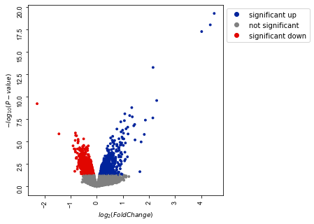
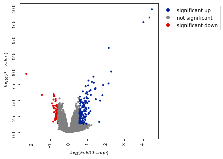

## Combinatorial effects of estrogen with progestogens or androgen in the breast cancer cell line ZR-75-1


```python
import pandas as pd
```


```python
from bioinfokit import analys, visuz
```

[Dataset](https://www.ncbi.nlm.nih.gov/geo/query/acc.cgi?acc=GSE61368)

### Sample Information


```python
sample_info = pd.read_table(r"F:\snijesh\OneDrive - St John's National Academy of Health Sciences\Re_analysis\SNJ_WorkingDirectory\GSE61368\sample_info_dht_er.txt")
sample_info
```


<div>
<style scoped>
    .dataframe tbody tr th:only-of-type {
        vertical-align: middle;
    }

    .dataframe tbody tr th {
        vertical-align: top;
    }

    .dataframe thead th {
        text-align: right;
    }
</style>
<table border="1" class="dataframe">
  <thead>
    <tr style="text-align: right;">
      <th></th>
      <th>SAMPLE_ID</th>
      <th>SAMPLE_NAME</th>
    </tr>
  </thead>
  <tbody>
    <tr>
      <td>0</td>
      <td>GSM1503194</td>
      <td>ZR751_VC_rep4</td>
    </tr>
    <tr>
      <td>1</td>
      <td>GSM1503207</td>
      <td>ZR751_VC_rep3</td>
    </tr>
    <tr>
      <td>2</td>
      <td>GSM1503181</td>
      <td>ZR751_VC_rep2</td>
    </tr>
    <tr>
      <td>3</td>
      <td>GSM1503183</td>
      <td>ZR751_VC_rep1</td>
    </tr>
    <tr>
      <td>4</td>
      <td>GSM1503209</td>
      <td>ZR751_E2s_rep4</td>
    </tr>
    <tr>
      <td>5</td>
      <td>GSM1503197</td>
      <td>ZR751_E2s_rep3</td>
    </tr>
    <tr>
      <td>6</td>
      <td>GSM1503191</td>
      <td>ZR751_E2s_rep2</td>
    </tr>
    <tr>
      <td>7</td>
      <td>GSM1503190</td>
      <td>ZR751_E2s_rep1</td>
    </tr>
    <tr>
      <td>8</td>
      <td>GSM1503179</td>
      <td>ZR751_E2s_DHT_rep4</td>
    </tr>
    <tr>
      <td>9</td>
      <td>GSM1503188</td>
      <td>ZR751_E2s_DHT_rep3</td>
    </tr>
    <tr>
      <td>10</td>
      <td>GSM1503189</td>
      <td>ZR751_E2s_DHT_rep2</td>
    </tr>
    <tr>
      <td>11</td>
      <td>GSM1503193</td>
      <td>ZR751_E2s_DHT_rep1</td>
    </tr>
    <tr>
      <td>12</td>
      <td>GSM1503192</td>
      <td>ZR751_DHT_rep4</td>
    </tr>
    <tr>
      <td>13</td>
      <td>GSM1503210</td>
      <td>ZR751_DHT_rep3</td>
    </tr>
    <tr>
      <td>14</td>
      <td>GSM1503200</td>
      <td>ZR751_DHT_rep2</td>
    </tr>
    <tr>
      <td>15</td>
      <td>GSM1503199</td>
      <td>ZR751_DHT_rep1</td>
    </tr>
  </tbody>
</table>
</div>


### Base genes
There were total 314 base genes from different class as AR, ER and PR


```python
base_genes = pd.read_table(r"F:\snijesh\OneDrive - St John's National Academy of Health Sciences\Re_analysis\SNJ_WorkingDirectory\GSE61368\base_genes.txt")
base_genes
```


<div>
<style scoped>
    .dataframe tbody tr th:only-of-type {
        vertical-align: middle;
    }

    .dataframe tbody tr th {
        vertical-align: top;
    }

    .dataframe thead th {
        text-align: right;
    }
</style>
<table border="1" class="dataframe">
  <thead>
    <tr style="text-align: right;">
      <th></th>
      <th>GeneID</th>
      <th>Class</th>
      <th>EntrezID</th>
      <th>GeneName</th>
      <th>MappedID</th>
      <th>MapScore</th>
      <th>IS_BASE</th>
    </tr>
  </thead>
  <tbody>
    <tr>
      <td>0</td>
      <td>DOCK10</td>
      <td>AR</td>
      <td>55619</td>
      <td>DOCK10 (dedicator of cytokinesis 10)</td>
      <td>DOCK10</td>
      <td>1</td>
      <td>1</td>
    </tr>
    <tr>
      <td>1</td>
      <td>SCIN</td>
      <td>AR</td>
      <td>85477</td>
      <td>SCIN (scinderin)</td>
      <td>SCIN</td>
      <td>1</td>
      <td>1</td>
    </tr>
    <tr>
      <td>2</td>
      <td>CBLN2</td>
      <td>AR</td>
      <td>147381</td>
      <td>CBLN2 (cerebellin 2 precursor)</td>
      <td>CBLN2</td>
      <td>1</td>
      <td>1</td>
    </tr>
    <tr>
      <td>3</td>
      <td>CD9</td>
      <td>AR</td>
      <td>928</td>
      <td>CD9 (CD9 molecule)</td>
      <td>CD9</td>
      <td>1</td>
      <td>1</td>
    </tr>
    <tr>
      <td>4</td>
      <td>PIP</td>
      <td>AR</td>
      <td>5304</td>
      <td>PIP (prolactin induced protein)</td>
      <td>PIP</td>
      <td>1</td>
      <td>1</td>
    </tr>
    <tr>
      <td>...</td>
      <td>...</td>
      <td>...</td>
      <td>...</td>
      <td>...</td>
      <td>...</td>
      <td>...</td>
      <td>...</td>
    </tr>
    <tr>
      <td>309</td>
      <td>DKFZP564K0822</td>
      <td>ER</td>
      <td>81552</td>
      <td>VOPP1 (VOPP1 WW domain binding protein)</td>
      <td>VOPP1</td>
      <td>0</td>
      <td>1</td>
    </tr>
    <tr>
      <td>310</td>
      <td>FLJ20151</td>
      <td>ER</td>
      <td>771</td>
      <td>CA12 (carbonic anhydrase 12)</td>
      <td>CA12</td>
      <td>0</td>
      <td>1</td>
    </tr>
    <tr>
      <td>311</td>
      <td>KIAA1025</td>
      <td>ER</td>
      <td>23389</td>
      <td>MED13L (mediator complex subunit 13L)</td>
      <td>MED13L</td>
      <td>0</td>
      <td>1</td>
    </tr>
    <tr>
      <td>312</td>
      <td>FLJ23186</td>
      <td>ER</td>
      <td>79669</td>
      <td>C3orf52 (chromosome 3 open reading frame 52)</td>
      <td>C3orf52</td>
      <td>0</td>
      <td>1</td>
    </tr>
    <tr>
      <td>313</td>
      <td>MGC4171</td>
      <td>ER</td>
      <td>79153</td>
      <td>GDPD3 (glycerophosphodiester phosphodiesteras...</td>
      <td>GDPD3</td>
      <td>0</td>
      <td>1</td>
    </tr>
  </tbody>
</table>
<p>314 rows × 7 columns</p>
</div>


```python

```

### Gene regulation of DHT in comparison with VC


```python
dht_data = pd.read_table(r"F:\snijesh\OneDrive - St John's National Academy of Health Sciences\Re_analysis\SNJ_WorkingDirectory\GSE61368\dht_filtered\all_dht.txt", sep='\t')
dht_data
```


<div>
<style scoped>
    .dataframe tbody tr th:only-of-type {
        vertical-align: middle;
    }

    .dataframe tbody tr th {
        vertical-align: top;
    }

    .dataframe thead th {
        text-align: right;
    }
</style>
<table border="1" class="dataframe">
  <thead>
    <tr style="text-align: right;">
      <th></th>
      <th>Entrez_Gene_ID</th>
      <th>Symbol</th>
      <th>Coef.DHTx</th>
      <th>p.value.DHTx</th>
      <th>BASE_GENES</th>
      <th>FC</th>
    </tr>
  </thead>
  <tbody>
    <tr>
      <td>0</td>
      <td>1794</td>
      <td>DOCK2</td>
      <td>-2.291497</td>
      <td>6.260000e-10</td>
      <td>0</td>
      <td>-4.895640</td>
    </tr>
    <tr>
      <td>1</td>
      <td>147381</td>
      <td>CBLN2</td>
      <td>-1.453471</td>
      <td>1.440000e-06</td>
      <td>1</td>
      <td>-2.738662</td>
    </tr>
    <tr>
      <td>2</td>
      <td>25928</td>
      <td>SOSTDC1</td>
      <td>-0.912464</td>
      <td>3.090000e-05</td>
      <td>0</td>
      <td>-1.882258</td>
    </tr>
    <tr>
      <td>3</td>
      <td>91523</td>
      <td>FAM113B</td>
      <td>-0.871406</td>
      <td>6.810000e-05</td>
      <td>0</td>
      <td>-1.829445</td>
    </tr>
    <tr>
      <td>4</td>
      <td>8555</td>
      <td>CDC14B</td>
      <td>-0.846160</td>
      <td>2.120692e-02</td>
      <td>0</td>
      <td>-1.797710</td>
    </tr>
    <tr>
      <td>...</td>
      <td>...</td>
      <td>...</td>
      <td>...</td>
      <td>...</td>
      <td>...</td>
      <td>...</td>
    </tr>
    <tr>
      <td>25181</td>
      <td>7365</td>
      <td>UGT2B10</td>
      <td>2.156155</td>
      <td>5.740000e-14</td>
      <td>0</td>
      <td>4.457254</td>
    </tr>
    <tr>
      <td>25182</td>
      <td>9073</td>
      <td>CLDN8</td>
      <td>2.296008</td>
      <td>2.760000e-10</td>
      <td>0</td>
      <td>4.910970</td>
    </tr>
    <tr>
      <td>25183</td>
      <td>54490</td>
      <td>UGT2B28</td>
      <td>4.020398</td>
      <td>5.720000e-18</td>
      <td>0</td>
      <td>16.227830</td>
    </tr>
    <tr>
      <td>25184</td>
      <td>7364</td>
      <td>UGT2B7</td>
      <td>4.351573</td>
      <td>1.020000e-18</td>
      <td>0</td>
      <td>20.415222</td>
    </tr>
    <tr>
      <td>25185</td>
      <td>10720</td>
      <td>UGT2B11</td>
      <td>4.502725</td>
      <td>5.460000e-20</td>
      <td>0</td>
      <td>22.670194</td>
    </tr>
  </tbody>
</table>
<p>25186 rows × 6 columns</p>
</div>


**There were 2618 significant genes by p-value cut-off <= 0.05**


```python
dht_data[dht_data['p.value.DHTx'] <= 0.05]
```


<div>
<style scoped>
    .dataframe tbody tr th:only-of-type {
        vertical-align: middle;
    }

    .dataframe tbody tr th {
        vertical-align: top;
    }

    .dataframe thead th {
        text-align: right;
    }
</style>
<table border="1" class="dataframe">
  <thead>
    <tr style="text-align: right;">
      <th></th>
      <th>Entrez_Gene_ID</th>
      <th>Symbol</th>
      <th>Coef.DHTx</th>
      <th>p.value.DHTx</th>
      <th>BASE_GENES</th>
      <th>FC</th>
    </tr>
  </thead>
  <tbody>
    <tr>
      <td>0</td>
      <td>1794</td>
      <td>DOCK2</td>
      <td>-2.291497</td>
      <td>6.260000e-10</td>
      <td>0</td>
      <td>-4.895640</td>
    </tr>
    <tr>
      <td>1</td>
      <td>147381</td>
      <td>CBLN2</td>
      <td>-1.453471</td>
      <td>1.440000e-06</td>
      <td>1</td>
      <td>-2.738662</td>
    </tr>
    <tr>
      <td>2</td>
      <td>25928</td>
      <td>SOSTDC1</td>
      <td>-0.912464</td>
      <td>3.090000e-05</td>
      <td>0</td>
      <td>-1.882258</td>
    </tr>
    <tr>
      <td>3</td>
      <td>91523</td>
      <td>FAM113B</td>
      <td>-0.871406</td>
      <td>6.810000e-05</td>
      <td>0</td>
      <td>-1.829445</td>
    </tr>
    <tr>
      <td>4</td>
      <td>8555</td>
      <td>CDC14B</td>
      <td>-0.846160</td>
      <td>2.120692e-02</td>
      <td>0</td>
      <td>-1.797710</td>
    </tr>
    <tr>
      <td>...</td>
      <td>...</td>
      <td>...</td>
      <td>...</td>
      <td>...</td>
      <td>...</td>
      <td>...</td>
    </tr>
    <tr>
      <td>25181</td>
      <td>7365</td>
      <td>UGT2B10</td>
      <td>2.156155</td>
      <td>5.740000e-14</td>
      <td>0</td>
      <td>4.457254</td>
    </tr>
    <tr>
      <td>25182</td>
      <td>9073</td>
      <td>CLDN8</td>
      <td>2.296008</td>
      <td>2.760000e-10</td>
      <td>0</td>
      <td>4.910970</td>
    </tr>
    <tr>
      <td>25183</td>
      <td>54490</td>
      <td>UGT2B28</td>
      <td>4.020398</td>
      <td>5.720000e-18</td>
      <td>0</td>
      <td>16.227830</td>
    </tr>
    <tr>
      <td>25184</td>
      <td>7364</td>
      <td>UGT2B7</td>
      <td>4.351573</td>
      <td>1.020000e-18</td>
      <td>0</td>
      <td>20.415222</td>
    </tr>
    <tr>
      <td>25185</td>
      <td>10720</td>
      <td>UGT2B11</td>
      <td>4.502725</td>
      <td>5.460000e-20</td>
      <td>0</td>
      <td>22.670194</td>
    </tr>
  </tbody>
</table>
<p>2618 rows × 6 columns</p>
</div>


```python
#change parameter setting by keeping only significant pvalue of 0.05
visuz.gene_exp.volcano(df=dht_data, lfc='Coef.DHTx', pv='p.value.DHTx', lfc_thr=0, pv_thr=0.05, 
    color=("#00239CFF", "grey", "#E10600FF"), plotlegend=True, legendpos='upper right', show=True,
    legendanchor=(1.46,1))
```





```python
#dht_data[(dht_data['p.value.DHTx'] <= 0.05) & dht_data['FC'] <=1.4]
```


```python
#change parameter setting by keeping only significant pvalue of 0.05
visuz.gene_exp.volcano(df=dht_data, lfc='Coef.DHTx', pv='p.value.DHTx', lfc_thr=0.584962501, pv_thr=0.05, 
    color=("#00239CFF", "grey", "#E10600FF"), plotlegend=True, legendpos='upper right', show=True,
    legendanchor=(1.46,1))
```





```python

```

### The protein protein interaction network

There were about **411430** experimentally validated interactions in the repository


```python
hippie = pd.read_excel(r"F:\snijesh\OneDrive - St John's National Academy of Health Sciences\Re_analysis\Hippie\hippie_current.xlsx")
hippie
```


<div>
<style scoped>
    .dataframe tbody tr th:only-of-type {
        vertical-align: middle;
    }

    .dataframe tbody tr th {
        vertical-align: top;
    }

    .dataframe thead th {
        text-align: right;
    }
</style>
<table border="1" class="dataframe">
  <thead>
    <tr style="text-align: right;">
      <th></th>
      <th>Gene1</th>
      <th>EntrezID1</th>
      <th>Gene2</th>
      <th>EntrezID2</th>
      <th>Score</th>
      <th>Reference</th>
    </tr>
  </thead>
  <tbody>
    <tr>
      <td>0</td>
      <td>AL1A1_HUMAN</td>
      <td>216</td>
      <td>AL1A1_HUMAN</td>
      <td>216</td>
      <td>0.76</td>
      <td>experiments:in vivo,Two-hybrid;pmids:12081471,...</td>
    </tr>
    <tr>
      <td>1</td>
      <td>ITA7_HUMAN</td>
      <td>3679</td>
      <td>ACHA_HUMAN</td>
      <td>1134</td>
      <td>0.73</td>
      <td>experiments:in vivo,Affinity Capture-Western,a...</td>
    </tr>
    <tr>
      <td>2</td>
      <td>NEB1_HUMAN</td>
      <td>55607</td>
      <td>ACTG_HUMAN</td>
      <td>71</td>
      <td>0.65</td>
      <td>experiments:in vitro,in vivo;pmids:9362513,120...</td>
    </tr>
    <tr>
      <td>3</td>
      <td>SRGN_HUMAN</td>
      <td>5552</td>
      <td>CD44_HUMAN</td>
      <td>960</td>
      <td>0.63</td>
      <td>experiments:in vivo;pmids:9334256,16189514,167...</td>
    </tr>
    <tr>
      <td>4</td>
      <td>GRB7_HUMAN</td>
      <td>2886</td>
      <td>ERBB2_HUMAN</td>
      <td>2064</td>
      <td>0.90</td>
      <td>experiments:in vitro,in vivo,Reconstituted Com...</td>
    </tr>
    <tr>
      <td>...</td>
      <td>...</td>
      <td>...</td>
      <td>...</td>
      <td>...</td>
      <td>...</td>
      <td>...</td>
    </tr>
    <tr>
      <td>822855</td>
      <td>RM41_HUMAN</td>
      <td>64975</td>
      <td>CH60_HUMAN</td>
      <td>3329</td>
      <td>0.49</td>
      <td>pmids:29568061;sources:IntAct</td>
    </tr>
    <tr>
      <td>822856</td>
      <td>MTL5_HUMAN</td>
      <td>9633</td>
      <td>CS010_HUMAN</td>
      <td>56005</td>
      <td>0.63</td>
      <td>experiments:cross-linking study;pmids:30021884...</td>
    </tr>
    <tr>
      <td>822857</td>
      <td>C1TM_HUMAN</td>
      <td>25902</td>
      <td>KI67_HUMAN</td>
      <td>4288</td>
      <td>0.63</td>
      <td>experiments:anti tag coimmunoprecipitation;pmi...</td>
    </tr>
    <tr>
      <td>822858</td>
      <td>TBB2A_HUMAN</td>
      <td>7280</td>
      <td>DUX4_HUMAN</td>
      <td>22947</td>
      <td>0.56</td>
      <td>experiments:pull down;pmids:26816005;sources:I...</td>
    </tr>
    <tr>
      <td>822859</td>
      <td>ADT2_HUMAN</td>
      <td>292</td>
      <td>DICER_HUMAN</td>
      <td>23405</td>
      <td>0.63</td>
      <td>experiments:anti tag coimmunoprecipitation;pmi...</td>
    </tr>
  </tbody>
</table>
<p>822860 rows × 6 columns</p>
</div>


### DHT Filtered data by pvalue and base genes

**The following base genes were not present in the gene expression data** <br>
*MYBL1 <br>
TPBG <br>
RAPGEF5 <br>
BTBD2*
<br>

**There were about 2853 genes in the filtered data set**


```python
dht_filtered = pd.read_table(r"F:\snijesh\OneDrive - St John's National Academy of Health Sciences\Re_analysis\SNJ_WorkingDirectory\GSE61368\dht_filtered\dht_filtered.txt", sep="\t")
dht_filtered.rename(columns = {'Entrez_Gene_ID':'EntrezID1', 'Symbol':'Gene'}, inplace = True)
dht_filtered
```


<div>
<style scoped>
    .dataframe tbody tr th:only-of-type {
        vertical-align: middle;
    }

    .dataframe tbody tr th {
        vertical-align: top;
    }

    .dataframe thead th {
        text-align: right;
    }
</style>
<table border="1" class="dataframe">
  <thead>
    <tr style="text-align: right;">
      <th></th>
      <th>EntrezID1</th>
      <th>Gene</th>
      <th>DHT_FC_AB</th>
      <th>Coef.DHTx</th>
      <th>Coef.E2x</th>
      <th>Coef.E2s_DHTx</th>
      <th>p.value.DHTx</th>
      <th>p.value.E2x</th>
      <th>p.value.E2s_DHTx</th>
      <th>F.p.value</th>
      <th>...</th>
      <th>E2s_DHT.E2s_DHT.7</th>
      <th>E2s_DHT.E2s_DHT.8</th>
      <th>E2s.E2s.9</th>
      <th>E2s.E2s.10</th>
      <th>E2s.E2s.11</th>
      <th>E2s.E2s.12</th>
      <th>VC.VC.13</th>
      <th>VC.VC.14</th>
      <th>VC.VC.15</th>
      <th>VC.VC.16</th>
    </tr>
  </thead>
  <tbody>
    <tr>
      <td>0</td>
      <td>10720</td>
      <td>UGT2B11</td>
      <td>22.670194</td>
      <td>4.502725</td>
      <td>0.007919</td>
      <td>4.193142</td>
      <td>5.460000e-20</td>
      <td>0.913312</td>
      <td>1.630000e-19</td>
      <td>7.430000e-21</td>
      <td>...</td>
      <td>11.627002</td>
      <td>11.689726</td>
      <td>7.532511</td>
      <td>7.424440</td>
      <td>7.520010</td>
      <td>7.479279</td>
      <td>7.541637</td>
      <td>7.468985</td>
      <td>7.292565</td>
      <td>7.621379</td>
    </tr>
    <tr>
      <td>1</td>
      <td>7364</td>
      <td>UGT2B7</td>
      <td>21.933067</td>
      <td>4.455036</td>
      <td>-0.111752</td>
      <td>4.114524</td>
      <td>1.130000e-14</td>
      <td>0.489749</td>
      <td>3.750000e-14</td>
      <td>1.370000e-15</td>
      <td>...</td>
      <td>11.992440</td>
      <td>11.999150</td>
      <td>7.905320</td>
      <td>7.993520</td>
      <td>7.826018</td>
      <td>7.544326</td>
      <td>8.560143</td>
      <td>7.694387</td>
      <td>7.599887</td>
      <td>7.861774</td>
    </tr>
    <tr>
      <td>2</td>
      <td>54490</td>
      <td>UGT2B28</td>
      <td>16.227830</td>
      <td>4.020398</td>
      <td>0.002102</td>
      <td>3.844580</td>
      <td>5.720000e-18</td>
      <td>0.980937</td>
      <td>1.130000e-17</td>
      <td>6.470000e-19</td>
      <td>...</td>
      <td>11.244050</td>
      <td>11.307440</td>
      <td>7.358644</td>
      <td>7.515116</td>
      <td>7.169713</td>
      <td>7.275634</td>
      <td>7.335238</td>
      <td>7.266879</td>
      <td>7.295437</td>
      <td>7.413143</td>
    </tr>
    <tr>
      <td>3</td>
      <td>79098</td>
      <td>C1orf116</td>
      <td>7.163982</td>
      <td>2.840762</td>
      <td>0.745949</td>
      <td>3.045289</td>
      <td>2.920000e-05</td>
      <td>0.145285</td>
      <td>1.350000e-05</td>
      <td>1.710000e-05</td>
      <td>...</td>
      <td>10.312230</td>
      <td>10.646620</td>
      <td>7.582353</td>
      <td>10.509210</td>
      <td>7.345705</td>
      <td>7.499827</td>
      <td>7.540352</td>
      <td>7.457951</td>
      <td>7.424345</td>
      <td>7.530653</td>
    </tr>
    <tr>
      <td>4</td>
      <td>9073</td>
      <td>CLDN8</td>
      <td>4.910970</td>
      <td>2.296008</td>
      <td>0.090345</td>
      <td>2.233285</td>
      <td>2.760000e-10</td>
      <td>0.582655</td>
      <td>4.110000e-10</td>
      <td>4.480000e-11</td>
      <td>...</td>
      <td>11.065780</td>
      <td>10.982660</td>
      <td>8.871125</td>
      <td>9.389898</td>
      <td>8.712326</td>
      <td>8.603893</td>
      <td>9.107178</td>
      <td>8.619504</td>
      <td>8.602058</td>
      <td>8.887124</td>
    </tr>
    <tr>
      <td>...</td>
      <td>...</td>
      <td>...</td>
      <td>...</td>
      <td>...</td>
      <td>...</td>
      <td>...</td>
      <td>...</td>
      <td>...</td>
      <td>...</td>
      <td>...</td>
      <td>...</td>
      <td>...</td>
      <td>...</td>
      <td>...</td>
      <td>...</td>
      <td>...</td>
      <td>...</td>
      <td>...</td>
      <td>...</td>
      <td>...</td>
      <td>...</td>
    </tr>
    <tr>
      <td>2848</td>
      <td>79866</td>
      <td>FLJ22624</td>
      <td>1.006614</td>
      <td>0.009510</td>
      <td>0.367980</td>
      <td>0.487542</td>
      <td>9.785474e-01</td>
      <td>0.306588</td>
      <td>1.810138e-01</td>
      <td>4.088471e-01</td>
      <td>...</td>
      <td>10.510120</td>
      <td>10.460220</td>
      <td>10.288860</td>
      <td>9.857463</td>
      <td>10.003080</td>
      <td>10.705000</td>
      <td>8.609527</td>
      <td>10.448460</td>
      <td>10.461080</td>
      <td>9.863406</td>
    </tr>
    <tr>
      <td>2849</td>
      <td>11098</td>
      <td>PRSS23</td>
      <td>1.003900</td>
      <td>-0.005616</td>
      <td>0.094756</td>
      <td>0.059907</td>
      <td>9.488514e-01</td>
      <td>0.288176</td>
      <td>4.970879e-01</td>
      <td>6.047325e-01</td>
      <td>...</td>
      <td>7.099221</td>
      <td>7.343617</td>
      <td>7.325781</td>
      <td>7.215397</td>
      <td>7.247726</td>
      <td>7.104076</td>
      <td>7.221463</td>
      <td>7.094407</td>
      <td>7.223404</td>
      <td>6.974682</td>
    </tr>
    <tr>
      <td>2850</td>
      <td>4168</td>
      <td>MCF2</td>
      <td>1.001753</td>
      <td>-0.002527</td>
      <td>-0.079040</td>
      <td>-0.060883</td>
      <td>9.788636e-01</td>
      <td>0.412633</td>
      <td>5.261308e-01</td>
      <td>7.758625e-01</td>
      <td>...</td>
      <td>7.572356</td>
      <td>7.258362</td>
      <td>7.468513</td>
      <td>7.404345</td>
      <td>7.323707</td>
      <td>7.389096</td>
      <td>7.278719</td>
      <td>7.405682</td>
      <td>7.566448</td>
      <td>7.650971</td>
    </tr>
    <tr>
      <td>2851</td>
      <td>374</td>
      <td>AREG</td>
      <td>1.001595</td>
      <td>0.002299</td>
      <td>0.050324</td>
      <td>0.026288</td>
      <td>9.764632e-01</td>
      <td>0.521222</td>
      <td>7.363002e-01</td>
      <td>9.018089e-01</td>
      <td>...</td>
      <td>6.903424</td>
      <td>7.156987</td>
      <td>7.090745</td>
      <td>7.075513</td>
      <td>7.223119</td>
      <td>6.957905</td>
      <td>7.090128</td>
      <td>6.965670</td>
      <td>6.978448</td>
      <td>7.111740</td>
    </tr>
    <tr>
      <td>2852</td>
      <td>2099</td>
      <td>ESR1</td>
      <td>1.001518</td>
      <td>0.002188</td>
      <td>0.118045</td>
      <td>0.063401</td>
      <td>9.925340e-01</td>
      <td>0.615165</td>
      <td>7.865345e-01</td>
      <td>9.469416e-01</td>
      <td>...</td>
      <td>10.748790</td>
      <td>10.873980</td>
      <td>11.159070</td>
      <td>10.254660</td>
      <td>11.038070</td>
      <td>11.102080</td>
      <td>9.907896</td>
      <td>11.097600</td>
      <td>11.078030</td>
      <td>10.998180</td>
    </tr>
  </tbody>
</table>
<p>2853 rows × 27 columns</p>
</div>


### Extracting the interaction of filtered genes from the protein interaction network

Number genes mapped to protein interaction network: 2012 {nodes} -- 20118{Edges}


```python

```

### Subnetwork Creation based on base genes, hubs and their interacting partners

Number genes mapped to protein interaction network: 1610 {nodes} -- 18424{Edges}


```python
ppi_map = hippie.merge(dht_filtered, on='EntrezID1')
ppi_map
```


<div>
<style scoped>
    .dataframe tbody tr th:only-of-type {
        vertical-align: middle;
    }

    .dataframe tbody tr th {
        vertical-align: top;
    }

    .dataframe thead th {
        text-align: right;
    }
</style>
<table border="1" class="dataframe">
  <thead>
    <tr style="text-align: right;">
      <th></th>
      <th>Gene1</th>
      <th>EntrezID1</th>
      <th>Gene2</th>
      <th>EntrezID2</th>
      <th>Score</th>
      <th>Reference</th>
      <th>Gene</th>
      <th>DHT_FC_AB</th>
      <th>Coef.DHTx</th>
      <th>Coef.E2x</th>
      <th>...</th>
      <th>E2s_DHT.E2s_DHT.7</th>
      <th>E2s_DHT.E2s_DHT.8</th>
      <th>E2s.E2s.9</th>
      <th>E2s.E2s.10</th>
      <th>E2s.E2s.11</th>
      <th>E2s.E2s.12</th>
      <th>VC.VC.13</th>
      <th>VC.VC.14</th>
      <th>VC.VC.15</th>
      <th>VC.VC.16</th>
    </tr>
  </thead>
  <tbody>
    <tr>
      <td>0</td>
      <td>P85B_HUMAN</td>
      <td>5296</td>
      <td>ERBB2_HUMAN</td>
      <td>2064</td>
      <td>0.89</td>
      <td>experiments:in vivo,Reconstituted Complex,Bioc...</td>
      <td>PIK3R2</td>
      <td>1.291679</td>
      <td>-0.369247</td>
      <td>-0.214582</td>
      <td>...</td>
      <td>13.521280</td>
      <td>13.883590</td>
      <td>13.959150</td>
      <td>13.864500</td>
      <td>13.822540</td>
      <td>13.556710</td>
      <td>14.399880</td>
      <td>13.692710</td>
      <td>13.922580</td>
      <td>14.046060</td>
    </tr>
    <tr>
      <td>1</td>
      <td>P85B_HUMAN</td>
      <td>5296</td>
      <td>KIT_HUMAN</td>
      <td>3815</td>
      <td>0.89</td>
      <td>experiments:in vitro,in vivo,Two-hybrid,coimmu...</td>
      <td>PIK3R2</td>
      <td>1.291679</td>
      <td>-0.369247</td>
      <td>-0.214582</td>
      <td>...</td>
      <td>13.521280</td>
      <td>13.883590</td>
      <td>13.959150</td>
      <td>13.864500</td>
      <td>13.822540</td>
      <td>13.556710</td>
      <td>14.399880</td>
      <td>13.692710</td>
      <td>13.922580</td>
      <td>14.046060</td>
    </tr>
    <tr>
      <td>2</td>
      <td>P85B_HUMAN</td>
      <td>5296</td>
      <td>CBL_HUMAN</td>
      <td>867</td>
      <td>0.96</td>
      <td>experiments:in vivo,Affinity Capture-Western,a...</td>
      <td>PIK3R2</td>
      <td>1.291679</td>
      <td>-0.369247</td>
      <td>-0.214582</td>
      <td>...</td>
      <td>13.521280</td>
      <td>13.883590</td>
      <td>13.959150</td>
      <td>13.864500</td>
      <td>13.822540</td>
      <td>13.556710</td>
      <td>14.399880</td>
      <td>13.692710</td>
      <td>13.922580</td>
      <td>14.046060</td>
    </tr>
    <tr>
      <td>3</td>
      <td>P85B_HUMAN</td>
      <td>5296</td>
      <td>TGFR1_HUMAN</td>
      <td>7046</td>
      <td>0.73</td>
      <td>experiments:in vivo,Affinity Capture-Western,a...</td>
      <td>PIK3R2</td>
      <td>1.291679</td>
      <td>-0.369247</td>
      <td>-0.214582</td>
      <td>...</td>
      <td>13.521280</td>
      <td>13.883590</td>
      <td>13.959150</td>
      <td>13.864500</td>
      <td>13.822540</td>
      <td>13.556710</td>
      <td>14.399880</td>
      <td>13.692710</td>
      <td>13.922580</td>
      <td>14.046060</td>
    </tr>
    <tr>
      <td>4</td>
      <td>P85B_HUMAN</td>
      <td>5296</td>
      <td>GRB2_HUMAN</td>
      <td>2885</td>
      <td>0.89</td>
      <td>experiments:in vivo,tandem affinity purificati...</td>
      <td>PIK3R2</td>
      <td>1.291679</td>
      <td>-0.369247</td>
      <td>-0.214582</td>
      <td>...</td>
      <td>13.521280</td>
      <td>13.883590</td>
      <td>13.959150</td>
      <td>13.864500</td>
      <td>13.822540</td>
      <td>13.556710</td>
      <td>14.399880</td>
      <td>13.692710</td>
      <td>13.922580</td>
      <td>14.046060</td>
    </tr>
    <tr>
      <td>...</td>
      <td>...</td>
      <td>...</td>
      <td>...</td>
      <td>...</td>
      <td>...</td>
      <td>...</td>
      <td>...</td>
      <td>...</td>
      <td>...</td>
      <td>...</td>
      <td>...</td>
      <td>...</td>
      <td>...</td>
      <td>...</td>
      <td>...</td>
      <td>...</td>
      <td>...</td>
      <td>...</td>
      <td>...</td>
      <td>...</td>
      <td>...</td>
    </tr>
    <tr>
      <td>124337</td>
      <td>MYCT1_HUMAN</td>
      <td>80177</td>
      <td>ANGI_HUMAN</td>
      <td>283</td>
      <td>0.63</td>
      <td>experiments:anti bait coimmunoprecipitation;pm...</td>
      <td>MYCT1</td>
      <td>1.125370</td>
      <td>0.170399</td>
      <td>0.214693</td>
      <td>...</td>
      <td>7.065520</td>
      <td>7.074265</td>
      <td>7.287970</td>
      <td>7.131314</td>
      <td>7.273762</td>
      <td>7.136626</td>
      <td>6.971344</td>
      <td>6.895936</td>
      <td>7.168178</td>
      <td>6.935443</td>
    </tr>
    <tr>
      <td>124338</td>
      <td>NDST4_HUMAN</td>
      <td>64579</td>
      <td>NPM_HUMAN</td>
      <td>4869</td>
      <td>0.63</td>
      <td>experiments:cross-linking study;pmids:30021884...</td>
      <td>NDST4</td>
      <td>1.278276</td>
      <td>-0.354200</td>
      <td>-0.294368</td>
      <td>...</td>
      <td>7.589926</td>
      <td>7.687297</td>
      <td>7.918320</td>
      <td>7.332326</td>
      <td>7.843875</td>
      <td>7.669672</td>
      <td>8.212349</td>
      <td>8.063746</td>
      <td>7.787245</td>
      <td>7.878324</td>
    </tr>
    <tr>
      <td>124339</td>
      <td>TMM82_HUMAN</td>
      <td>388595</td>
      <td>H2BFS_HUMAN</td>
      <td>54145</td>
      <td>0.63</td>
      <td>experiments:cross-linking study;pmids:30021884...</td>
      <td>LOC388595</td>
      <td>1.124469</td>
      <td>0.169244</td>
      <td>-0.013202</td>
      <td>...</td>
      <td>6.986114</td>
      <td>7.156987</td>
      <td>6.900301</td>
      <td>7.101864</td>
      <td>7.008413</td>
      <td>7.115023</td>
      <td>7.105527</td>
      <td>7.009422</td>
      <td>6.955350</td>
      <td>7.108109</td>
    </tr>
    <tr>
      <td>124340</td>
      <td>ENTD1_HUMAN</td>
      <td>150350</td>
      <td>ECHA_HUMAN</td>
      <td>3030</td>
      <td>0.63</td>
      <td>experiments:cross-linking study;pmids:30021884...</td>
      <td>FLJ25421</td>
      <td>1.186047</td>
      <td>0.246161</td>
      <td>0.140317</td>
      <td>...</td>
      <td>7.293448</td>
      <td>7.483295</td>
      <td>7.319410</td>
      <td>7.624532</td>
      <td>7.371113</td>
      <td>7.285193</td>
      <td>7.441776</td>
      <td>7.281055</td>
      <td>7.238233</td>
      <td>7.077915</td>
    </tr>
    <tr>
      <td>124341</td>
      <td>NPAL2_HUMAN</td>
      <td>79815</td>
      <td>ADRB2_HUMAN</td>
      <td>154</td>
      <td>0.63</td>
      <td>experiments:ubiquitin reconstruction;pmids:282...</td>
      <td>NPAL2</td>
      <td>1.275997</td>
      <td>-0.351625</td>
      <td>-0.339706</td>
      <td>...</td>
      <td>8.428328</td>
      <td>8.743150</td>
      <td>8.679960</td>
      <td>9.029679</td>
      <td>8.379155</td>
      <td>8.211940</td>
      <td>9.091882</td>
      <td>8.668315</td>
      <td>9.124519</td>
      <td>8.774841</td>
    </tr>
  </tbody>
</table>
<p>124342 rows × 32 columns</p>
</div>


```python
ppi_map.to_csv(r"F:\snijesh\OneDrive - St John's National Academy of Health Sciences\Re_analysis\SNJ_WorkingDirectory\GSE61368\dht_filtered\dht_ppi.txt", sep='\t', index=False)
```


```python
ppi_4 = ppi_map[ppi_map['Score'] >= 0.4]
ppi_4_sel = ppi_4[['Gene1', 'EntrezID1', 'Gene2', 'EntrezID2','Score']]
ppi_4_sel
```


<div>
<style scoped>
    .dataframe tbody tr th:only-of-type {
        vertical-align: middle;
    }

    .dataframe tbody tr th {
        vertical-align: top;
    }

    .dataframe thead th {
        text-align: right;
    }
</style>
<table border="1" class="dataframe">
  <thead>
    <tr style="text-align: right;">
      <th></th>
      <th>Gene1</th>
      <th>EntrezID1</th>
      <th>Gene2</th>
      <th>EntrezID2</th>
      <th>Score</th>
    </tr>
  </thead>
  <tbody>
    <tr>
      <td>0</td>
      <td>P85B_HUMAN</td>
      <td>5296</td>
      <td>ERBB2_HUMAN</td>
      <td>2064</td>
      <td>0.89</td>
    </tr>
    <tr>
      <td>1</td>
      <td>P85B_HUMAN</td>
      <td>5296</td>
      <td>KIT_HUMAN</td>
      <td>3815</td>
      <td>0.89</td>
    </tr>
    <tr>
      <td>2</td>
      <td>P85B_HUMAN</td>
      <td>5296</td>
      <td>CBL_HUMAN</td>
      <td>867</td>
      <td>0.96</td>
    </tr>
    <tr>
      <td>3</td>
      <td>P85B_HUMAN</td>
      <td>5296</td>
      <td>TGFR1_HUMAN</td>
      <td>7046</td>
      <td>0.73</td>
    </tr>
    <tr>
      <td>4</td>
      <td>P85B_HUMAN</td>
      <td>5296</td>
      <td>GRB2_HUMAN</td>
      <td>2885</td>
      <td>0.89</td>
    </tr>
    <tr>
      <td>...</td>
      <td>...</td>
      <td>...</td>
      <td>...</td>
      <td>...</td>
      <td>...</td>
    </tr>
    <tr>
      <td>124337</td>
      <td>MYCT1_HUMAN</td>
      <td>80177</td>
      <td>ANGI_HUMAN</td>
      <td>283</td>
      <td>0.63</td>
    </tr>
    <tr>
      <td>124338</td>
      <td>NDST4_HUMAN</td>
      <td>64579</td>
      <td>NPM_HUMAN</td>
      <td>4869</td>
      <td>0.63</td>
    </tr>
    <tr>
      <td>124339</td>
      <td>TMM82_HUMAN</td>
      <td>388595</td>
      <td>H2BFS_HUMAN</td>
      <td>54145</td>
      <td>0.63</td>
    </tr>
    <tr>
      <td>124340</td>
      <td>ENTD1_HUMAN</td>
      <td>150350</td>
      <td>ECHA_HUMAN</td>
      <td>3030</td>
      <td>0.63</td>
    </tr>
    <tr>
      <td>124341</td>
      <td>NPAL2_HUMAN</td>
      <td>79815</td>
      <td>ADRB2_HUMAN</td>
      <td>154</td>
      <td>0.63</td>
    </tr>
  </tbody>
</table>
<p>122341 rows × 5 columns</p>
</div>


```python
ppi_4_sel.to_csv('ppi_4_sel.txt', sep='\t', index=False)
```

### Calcuation of Functional Similarity

Functional similarity of the all the filtered genes were calculated and remapped to gene pairs in the subnetwork created using hubs and base genes


```python
#Semantic Similarity
semantic_similarity = pd.read_table(r"F:\snijesh\OneDrive - St John's National Academy of Health Sciences\Re_analysis\SNJ_WorkingDirectory\GSE61368\Semantic_Similarity\result_mf.txt", sep='\t')
semantic_similarity.rename(columns = {'Var1':'Gene-1', 'Var2':'Gene-2'}, inplace = True)
semantic_similarity = semantic_similarity[['Gene-1', 'Gene-2', 'Freq']]
semantic_similarity
```


<div>
<style scoped>
    .dataframe tbody tr th:only-of-type {
        vertical-align: middle;
    }

    .dataframe tbody tr th {
        vertical-align: top;
    }

    .dataframe thead th {
        text-align: right;
    }
</style>
<table border="1" class="dataframe">
  <thead>
    <tr style="text-align: right;">
      <th></th>
      <th>Gene-1</th>
      <th>Gene-2</th>
      <th>Freq</th>
    </tr>
  </thead>
  <tbody>
    <tr>
      <td>0</td>
      <td>10720</td>
      <td>10720</td>
      <td>1.000</td>
    </tr>
    <tr>
      <td>1</td>
      <td>7364</td>
      <td>10720</td>
      <td>1.000</td>
    </tr>
    <tr>
      <td>2</td>
      <td>54490</td>
      <td>10720</td>
      <td>1.000</td>
    </tr>
    <tr>
      <td>3</td>
      <td>79098</td>
      <td>10720</td>
      <td>0.267</td>
    </tr>
    <tr>
      <td>4</td>
      <td>9073</td>
      <td>10720</td>
      <td>0.162</td>
    </tr>
    <tr>
      <td>...</td>
      <td>...</td>
      <td>...</td>
      <td>...</td>
    </tr>
    <tr>
      <td>4644020</td>
      <td>79174</td>
      <td>2099</td>
      <td>1.000</td>
    </tr>
    <tr>
      <td>4644021</td>
      <td>79866</td>
      <td>2099</td>
      <td>0.552</td>
    </tr>
    <tr>
      <td>4644022</td>
      <td>4168</td>
      <td>2099</td>
      <td>0.511</td>
    </tr>
    <tr>
      <td>4644023</td>
      <td>374</td>
      <td>2099</td>
      <td>0.525</td>
    </tr>
    <tr>
      <td>4644024</td>
      <td>2099</td>
      <td>2099</td>
      <td>1.000</td>
    </tr>
  </tbody>
</table>
<p>4644025 rows × 3 columns</p>
</div>


```python
edge_map = pd.read_table(r"F:\snijesh\OneDrive - St John's National Academy of Health Sciences\Re_analysis\SNJ_WorkingDirectory\GSE61368\dht_filtered\edge_map.txt", sep='\t')
edge_map
```


<div>
<style scoped>
    .dataframe tbody tr th:only-of-type {
        vertical-align: middle;
    }

    .dataframe tbody tr th {
        vertical-align: top;
    }

    .dataframe thead th {
        text-align: right;
    }
</style>
<table border="1" class="dataframe">
  <thead>
    <tr style="text-align: right;">
      <th></th>
      <th>Gene-1</th>
      <th>Gene-2</th>
      <th>Score</th>
      <th>Gene1FC</th>
      <th>Gene2FC</th>
    </tr>
  </thead>
  <tbody>
    <tr>
      <td>0</td>
      <td>7163</td>
      <td>2026</td>
      <td>0.49</td>
      <td>1.416390</td>
      <td>1.143308</td>
    </tr>
    <tr>
      <td>1</td>
      <td>7163</td>
      <td>8339</td>
      <td>0.49</td>
      <td>1.416390</td>
      <td>1.250801</td>
    </tr>
    <tr>
      <td>2</td>
      <td>7163</td>
      <td>999</td>
      <td>0.49</td>
      <td>1.416390</td>
      <td>-1.220840</td>
    </tr>
    <tr>
      <td>3</td>
      <td>5723</td>
      <td>26227</td>
      <td>0.49</td>
      <td>-1.238130</td>
      <td>-1.304590</td>
    </tr>
    <tr>
      <td>4</td>
      <td>6652</td>
      <td>1410</td>
      <td>0.49</td>
      <td>1.378976</td>
      <td>1.260996</td>
    </tr>
    <tr>
      <td>...</td>
      <td>...</td>
      <td>...</td>
      <td>...</td>
      <td>...</td>
      <td>...</td>
    </tr>
    <tr>
      <td>36843</td>
      <td>80308</td>
      <td>6652</td>
      <td>0.49</td>
      <td>1.263792</td>
      <td>1.378976</td>
    </tr>
    <tr>
      <td>36844</td>
      <td>261726</td>
      <td>6652</td>
      <td>0.49</td>
      <td>1.177023</td>
      <td>1.378976</td>
    </tr>
    <tr>
      <td>36845</td>
      <td>3326</td>
      <td>81788</td>
      <td>0.49</td>
      <td>-1.282545</td>
      <td>-1.267591</td>
    </tr>
    <tr>
      <td>36846</td>
      <td>51755</td>
      <td>9128</td>
      <td>0.49</td>
      <td>-1.185291</td>
      <td>-1.396057</td>
    </tr>
    <tr>
      <td>36847</td>
      <td>4771</td>
      <td>81847</td>
      <td>0.49</td>
      <td>-1.150655</td>
      <td>1.243495</td>
    </tr>
  </tbody>
</table>
<p>36848 rows × 5 columns</p>
</div>


```python
edge_semantic_map = pd.merge(edge_map,semantic_similarity, on=['Gene-1','Gene-2'], how ='left')
edge_semantic_map
```


<div>
<style scoped>
    .dataframe tbody tr th:only-of-type {
        vertical-align: middle;
    }

    .dataframe tbody tr th {
        vertical-align: top;
    }

    .dataframe thead th {
        text-align: right;
    }
</style>
<table border="1" class="dataframe">
  <thead>
    <tr style="text-align: right;">
      <th></th>
      <th>Gene-1</th>
      <th>Gene-2</th>
      <th>Score</th>
      <th>Gene1FC</th>
      <th>Gene2FC</th>
      <th>Freq</th>
    </tr>
  </thead>
  <tbody>
    <tr>
      <td>0</td>
      <td>7163</td>
      <td>2026</td>
      <td>0.49</td>
      <td>1.416390</td>
      <td>1.143308</td>
      <td>0.635</td>
    </tr>
    <tr>
      <td>1</td>
      <td>7163</td>
      <td>8339</td>
      <td>0.49</td>
      <td>1.416390</td>
      <td>1.250801</td>
      <td>0.711</td>
    </tr>
    <tr>
      <td>2</td>
      <td>7163</td>
      <td>999</td>
      <td>0.49</td>
      <td>1.416390</td>
      <td>-1.220840</td>
      <td>0.864</td>
    </tr>
    <tr>
      <td>3</td>
      <td>5723</td>
      <td>26227</td>
      <td>0.49</td>
      <td>-1.238130</td>
      <td>-1.304590</td>
      <td>0.201</td>
    </tr>
    <tr>
      <td>4</td>
      <td>6652</td>
      <td>1410</td>
      <td>0.49</td>
      <td>1.378976</td>
      <td>1.260996</td>
      <td>0.596</td>
    </tr>
    <tr>
      <td>...</td>
      <td>...</td>
      <td>...</td>
      <td>...</td>
      <td>...</td>
      <td>...</td>
      <td>...</td>
    </tr>
    <tr>
      <td>36843</td>
      <td>80308</td>
      <td>6652</td>
      <td>0.49</td>
      <td>1.263792</td>
      <td>1.378976</td>
      <td>0.450</td>
    </tr>
    <tr>
      <td>36844</td>
      <td>261726</td>
      <td>6652</td>
      <td>0.49</td>
      <td>1.177023</td>
      <td>1.378976</td>
      <td>0.815</td>
    </tr>
    <tr>
      <td>36845</td>
      <td>3326</td>
      <td>81788</td>
      <td>0.49</td>
      <td>-1.282545</td>
      <td>-1.267591</td>
      <td>0.615</td>
    </tr>
    <tr>
      <td>36846</td>
      <td>51755</td>
      <td>9128</td>
      <td>0.49</td>
      <td>-1.185291</td>
      <td>-1.396057</td>
      <td>0.523</td>
    </tr>
    <tr>
      <td>36847</td>
      <td>4771</td>
      <td>81847</td>
      <td>0.49</td>
      <td>-1.150655</td>
      <td>1.243495</td>
      <td>1.000</td>
    </tr>
  </tbody>
</table>
<p>36848 rows × 6 columns</p>
</div>


```python
edge_semantic_map.to_csv(r"F:\snijesh\OneDrive - St John's National Academy of Health Sciences\Re_analysis\SNJ_WorkingDirectory\GSE61368\dht_filtered\edge_semantic_map.txt", sep='\t', index=False)
```


```python

```


```python
Pearson = pd.read_table(r"F:\snijesh\OneDrive - St John's National Academy of Health Sciences\Re_analysis\SNJ_WorkingDirectory\GSE61368\Pearson\dht_vc.cor", sep='\t')
Pearson
```


<div>
<style scoped>
    .dataframe tbody tr th:only-of-type {
        vertical-align: middle;
    }

    .dataframe tbody tr th {
        vertical-align: top;
    }

    .dataframe thead th {
        text-align: right;
    }
</style>
<table border="1" class="dataframe">
  <thead>
    <tr style="text-align: right;">
      <th></th>
      <th>Gene-1</th>
      <th>Gene-2</th>
      <th>r-value</th>
    </tr>
  </thead>
  <tbody>
    <tr>
      <td>0</td>
      <td>10720</td>
      <td>10720</td>
      <td>1.000000</td>
    </tr>
    <tr>
      <td>1</td>
      <td>10720</td>
      <td>7364</td>
      <td>0.770695</td>
    </tr>
    <tr>
      <td>2</td>
      <td>10720</td>
      <td>54490</td>
      <td>-0.048142</td>
    </tr>
    <tr>
      <td>3</td>
      <td>10720</td>
      <td>79098</td>
      <td>-0.018324</td>
    </tr>
    <tr>
      <td>4</td>
      <td>10720</td>
      <td>9073</td>
      <td>0.926940</td>
    </tr>
    <tr>
      <td>...</td>
      <td>...</td>
      <td>...</td>
      <td>...</td>
    </tr>
    <tr>
      <td>8139604</td>
      <td>2099</td>
      <td>79866</td>
      <td>0.346464</td>
    </tr>
    <tr>
      <td>8139605</td>
      <td>2099</td>
      <td>11098</td>
      <td>0.123184</td>
    </tr>
    <tr>
      <td>8139606</td>
      <td>2099</td>
      <td>4168</td>
      <td>0.083146</td>
    </tr>
    <tr>
      <td>8139607</td>
      <td>2099</td>
      <td>374</td>
      <td>-0.312806</td>
    </tr>
    <tr>
      <td>8139608</td>
      <td>2099</td>
      <td>2099</td>
      <td>1.000000</td>
    </tr>
  </tbody>
</table>
<p>8139609 rows × 3 columns</p>
</div>


```python
edge_semantic_pearson_map = pd.merge(edge_semantic_map,Pearson, on=['Gene-1','Gene-2'], how ='left')
edge_semantic_pearson_map
```


<div>
<style scoped>
    .dataframe tbody tr th:only-of-type {
        vertical-align: middle;
    }

    .dataframe tbody tr th {
        vertical-align: top;
    }

    .dataframe thead th {
        text-align: right;
    }
</style>
<table border="1" class="dataframe">
  <thead>
    <tr style="text-align: right;">
      <th></th>
      <th>Gene-1</th>
      <th>Gene-2</th>
      <th>Score</th>
      <th>Gene1FC</th>
      <th>Gene2FC</th>
      <th>Freq</th>
      <th>r-value</th>
    </tr>
  </thead>
  <tbody>
    <tr>
      <td>0</td>
      <td>7163</td>
      <td>2026</td>
      <td>0.49</td>
      <td>1.416390</td>
      <td>1.143308</td>
      <td>0.635</td>
      <td>-0.878231</td>
    </tr>
    <tr>
      <td>1</td>
      <td>7163</td>
      <td>8339</td>
      <td>0.49</td>
      <td>1.416390</td>
      <td>1.250801</td>
      <td>0.711</td>
      <td>-0.030675</td>
    </tr>
    <tr>
      <td>2</td>
      <td>7163</td>
      <td>999</td>
      <td>0.49</td>
      <td>1.416390</td>
      <td>-1.220840</td>
      <td>0.864</td>
      <td>-0.075886</td>
    </tr>
    <tr>
      <td>3</td>
      <td>5723</td>
      <td>26227</td>
      <td>0.49</td>
      <td>-1.238130</td>
      <td>-1.304590</td>
      <td>0.201</td>
      <td>0.082900</td>
    </tr>
    <tr>
      <td>4</td>
      <td>6652</td>
      <td>1410</td>
      <td>0.49</td>
      <td>1.378976</td>
      <td>1.260996</td>
      <td>0.596</td>
      <td>0.077654</td>
    </tr>
    <tr>
      <td>...</td>
      <td>...</td>
      <td>...</td>
      <td>...</td>
      <td>...</td>
      <td>...</td>
      <td>...</td>
      <td>...</td>
    </tr>
    <tr>
      <td>36843</td>
      <td>80308</td>
      <td>6652</td>
      <td>0.49</td>
      <td>1.263792</td>
      <td>1.378976</td>
      <td>0.450</td>
      <td>-0.973937</td>
    </tr>
    <tr>
      <td>36844</td>
      <td>261726</td>
      <td>6652</td>
      <td>0.49</td>
      <td>1.177023</td>
      <td>1.378976</td>
      <td>0.815</td>
      <td>0.354324</td>
    </tr>
    <tr>
      <td>36845</td>
      <td>3326</td>
      <td>81788</td>
      <td>0.49</td>
      <td>-1.282545</td>
      <td>-1.267591</td>
      <td>0.615</td>
      <td>0.920835</td>
    </tr>
    <tr>
      <td>36846</td>
      <td>51755</td>
      <td>9128</td>
      <td>0.49</td>
      <td>-1.185291</td>
      <td>-1.396057</td>
      <td>0.523</td>
      <td>-0.600600</td>
    </tr>
    <tr>
      <td>36847</td>
      <td>4771</td>
      <td>81847</td>
      <td>0.49</td>
      <td>-1.150655</td>
      <td>1.243495</td>
      <td>1.000</td>
      <td>0.812059</td>
    </tr>
  </tbody>
</table>
<p>36848 rows × 7 columns</p>
</div>


```python
edge_semantic_pearson_map.to_csv(r"F:\snijesh\OneDrive - St John's National Academy of Health Sciences\Re_analysis\SNJ_WorkingDirectory\GSE61368\dht_filtered\edge_semantic_pearson_map.txt", sep='\t', index=False)
```
